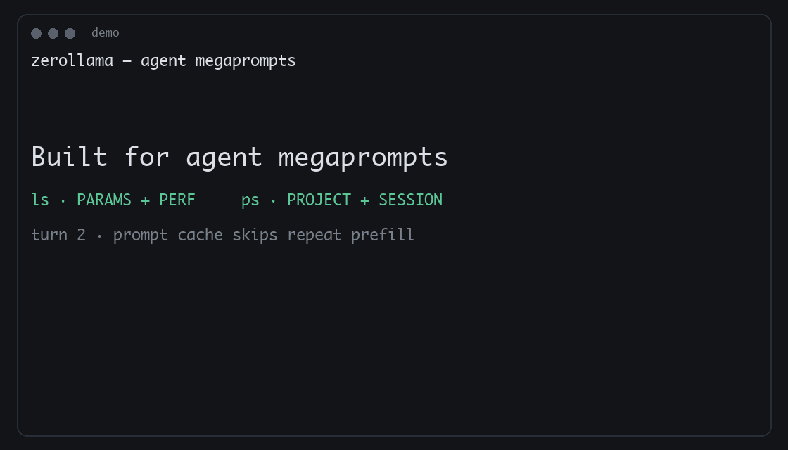

<p align="center">
  
</p>

# Zerollama

**Built for agent megaprompts — not toy chat windows.**

*Ollama-compatible agent fork* — same wire shape, different product (megaprompts, prompt cache, harness control, local image/video).

Agents re-send **huge context every turn** (tools, history, system prompts, clips). Zerollama makes that path fast: an **accelerated tokenizer** (work inspired by [Gigatoken](https://github.com/chynggi/gigatoken-llama.cpp)) — lab **~3–7×** vs stock on Qwen/GPT-2 megaprompts (e.g. Qwen2 chat **389→81 ms** / 1 MiB) — plus an **[SGLang](https://github.com/sgl-project/sglang) / [vLLM](https://github.com/vllm-project/vllm)-inspired prompt cache (L3)** so the *next* megaprompt on the same thread skips re-prefill. And when an agent needs to **explain with visuals**, local **image + video gen** lives on the same API — not a second product.

Same CLI / REST / clients as [ollama/ollama](https://github.com/ollama/ollama). Extra control plane, doctor, training, and fleet on **Apple Silicon**, **CUDA**, and **Arc**.

> **Not upstream Ollama.** Build from this repo (`./zerollama`), not [ollama.com/install.sh](https://ollama.com/install.sh).

| | |
|--|--|
| **For you if** | You run Hermes / coding agents / multi-tenant GPUs; megaprompts every turn; need QoS, prompt cache, or local image/video on the same daemon |
| **Not for you if** | You only want “pull a model and chat” once — use [upstream Ollama](https://github.com/ollama/ollama); zerollama is the agent fork |

### Lab numbers (why it feels faster)

| Win | Stock / cold | Zerollama |
|-----|--------------|-----------|
| Megaprompt **tokenize** (1 MiB) | Qwen2 / GPT-2 still **~270–390 ms** before any forward | **~3–7×** faster — Qwen2 chat **389→81 ms**, GPT-2 ascii **353→50 ms**, Qwen3.5 ascii **~20 ms** ([Gigatoken](https://github.com/chynggi/gigatoken-llama.cpp)-inspired) |
| **Next** megaprompt on same thread | Full prefill again | **Prompt cache (L3)** — turn 2+ reuses the prefix ([SGLang](https://github.com/sgl-project/sglang) / [vLLM](https://github.com/vllm-project/vllm)-inspired) |
| Apple Silicon **decode** (`llama3.2:3b`, ctx 4k) | ~155 tok/s (upstream path) | **~166 tok/s (+7%)** ggml Metal |

Evidence + reproduce: [readme-marketing-benches.md](docs/readme-marketing-benches.md) · `LLAMA_CPP_ROOT=../llama.cpp ./scripts/bench/run_tokenize_bpe_identity_bench.sh --bench`

| Read this far if you want… | Jump |
|----------------------------|------|
| Running in under a minute | [Quick start](#1-quick-start) |
| Feel the win in 30 seconds | [30-second win](#15-thirty-second-win) |
| Why megaprompts + visuals win | [Why Zerollama?](#2-why-zerollama) |
| “Will my Open WebUI / LangChain / Continue still work?” | [Compatibility](#3-ollama-compatible--hundreds-of-integrations) |
| Tour (megaprompts → visuals → harness → …) | [Tour](#4-tour--what-makes-us-different) |
| `ls` / `ps` fields (PARAMS, PERF, PROJECT…) | [Operator CLI](#46-operator-cli--ls--ps) |
| Harness-shaped API example | [Use the API](#5-use-the-api) |
| Build on Apple Silicon / CUDA / Arc | [Platforms](#6-build--platforms) |
| Deep docs, phases, experimental tracks | [Go deeper](#7-go-deeper) |
| Give your agent zerollama skills (Cursor/Claude/etc.) | [Agent skills](#8-agent-skills) |

---

## 1. Quick start

**Apple Silicon:**

```bash
git clone <this-repo> zerollama && cd zerollama
./scripts/runtime/dev_bootstrap.sh
./zerollama serve
./zerollama pull llama3.2:3b
./zerollama run llama3.2:3b
```

**CUDA** → [Build & platforms](#6-build--platforms) · **Arc** (Vulkan) → same section

```bash
# sanity
./zerollama doctor
curl -s http://127.0.0.1:11434/api/tags | jq .
```

Default listen is `:11434` (runtime sidecar often `:8081`). For lab/smoke work, prefer other ports so you don’t collide with a daily serve.

### 1.5 Thirty-second win

Once `./zerollama serve` is up and a model is pulled:

1. **Point the harness** — Hermes, OpenClaw, Continue, Open WebUI, etc. → `http://127.0.0.1:11434` (same as Ollama).
2. **Confirm it’s us** — `curl -s http://127.0.0.1:11434/api/version | jq .distribution` → `"zerollama"`.
3. **Send a stable thread key** every turn (`options.prompt_cache_key` or OpenAI top-level `prompt_cache_key`) + `qos_class: "interactive"` when you can.
4. **Feel turn 2** — same system/tools prefix should skip full prefill; TTFT drops. That’s the [SGLang](https://github.com/sgl-project/sglang) / [vLLM](https://github.com/vllm-project/vllm)-inspired prompt cache doing its job.
5. **See who owns the GPU** — `./zerollama ps` (PROJECT / SESSION) and `./zerollama ls` (PARAMS / PERF). Details: [§4.6](#46-operator-cli--ls--ps).

Copy-paste harness request: [§5 Use the API](#5-use-the-api).

<p align="center">
  
</p>

---

## 2. Why Zerollama?

Upstream is excellent at “pull a model and chat.” Agents don’t chat small — they ship **megaprompts** (and often need **pictures and clips** to explain the answer).

| Agent reality | Zerollama |
|---------------|-----------|
| Megaprompt tokenize burns **hundreds of ms** before any forward | **Accelerated BPE** inspired by [Gigatoken](https://github.com/chynggi/gigatoken-llama.cpp) — **~3–7×** on Qwen/GPT-2/Gemma4 (1 MiB); [benches](docs/readme-marketing-benches.md) |
| Same megaprompt / system prefix every turn feels like a cold start | **Prompt cache (L3)** — inspired by [SGLang](https://github.com/sgl-project/sglang) / [vLLM](https://github.com/vllm-project/vllm): give the thread a stable key and **turn 2+ reuses the prefix** so the next megaprompt is way faster (optional `/api/cache/pin` to keep it warm) |
| Agents need to **show**, not only tell | **Image + video gen** on the same daemon — Wan `/v1/videos`, MLX/Comfy/sd.cpp `/v1/images`; VLM video understanding |
| Background jobs fight live agent threads | **Harness control plane** — QoS, timeouts, preempt reasons, capacity APIs |
| “Who owns the GPU?” is guesswork | **`zerollama ps`** shows **PROJECT** / **SESSION**; **`ls`** shows **PARAMS** + **CTX** (host-safe) + **PERF** |
| “Model bugs” that are really server traps | **`zerollama doctor`** + minefield probes |
| Train / multi-node | `/api/train/*`, `zerollama fleet serve`, Eliza Cloud |

Full matrix + architecture: [docs/upstream-ollama-diff.md](docs/upstream-ollama-diff.md)

---

## 3. Ollama-compatible — hundreds of integrations

Point anything that speaks Ollama at `http://127.0.0.1:11434` (or your host). Same `/api/*`, same OpenAI-shaped `/v1/*`, same [ollama-python](https://github.com/ollama/ollama-python) / [ollama-js](https://github.com/ollama/ollama-js) clients.

```bash
zerollama launch claude      # Claude Code, Codex, Copilot, OpenCode, …
zerollama launch openclaw    # WhatsApp / Telegram / Discord assistant
zerollama run gemma3
```

**Community apps, IDEs, RAG stacks, bots, SDKs:** we don’t maintain a second copy of that list. Use upstream’s catalog — **hundreds of integrations** work as-is against zerollama:

→ [ollama/ollama § Community Integrations](https://github.com/ollama/ollama#community-integrations)

Cloud models use **[Eliza Cloud](https://www.elizacloud.ai)** (`model: …:cloud`), not legacy ollama.com signing — [eliza-cloud.md](docs/eliza-cloud.md).

---

## 4. Tour — what makes us different

Skim the headings. Dive only where you care. Deep guides linked at the end of each block.

### 4.1 Megaprompts: fast tokenize + prompt cache

Agents don’t send a sentence — they re-send **tools, history, system prompts, and clips** every turn. Two bottlenecks kill the feel of that stack:

1. **Encode** the megaprompt before any forward  
2. **Re-prefill** the same long prefix on every turn

**Accelerated tokenizer** — work **inspired by [Gigatoken](https://github.com/chynggi/gigatoken-llama.cpp)** ([chynggi](https://github.com/chynggi) — stellar), reimplemented in C++ inside vendored llama.cpp (bit-identical IDs; not the Rust crate). On Qwen2 / GPT-2, stock-style encode still costs **~270–390 ms** per **1 MiB** megaprompt **before any forward**.

| Layer | Measured win |
|-------|-------------|
| Id-pair BPE merge + tiered short merge | Gemma4 ~**3.4×**; Llama3 ~**1.8×** (mixed 1 MiB) |
| ASCII / SIMD pretok + blob | Qwen3.5 ascii ~**20 ms/MiB** (**5.8×**); GPT-2 ascii **7×** |
| Specials / chat markers | Qwen2 chat **~4.8×** (**389→81 ms**); GPT-2 chat **~3.3×** |
| Session pretok→ids cache | Code-like repeats (see [faster-bpe-tokenize.md](docs/faster-bpe-tokenize.md)) |

**Prompt cache (L3) — ELI5:**  
Think sticky notes on the GPU for “we already read this prefix.” You send a stable `prompt_cache_key` per agent thread. Turn 1 still pays prefill; **turn 2+ reuses that prefix** so the *next* megaprompt is way faster — same idea as [SGLang](https://github.com/sgl-project/sglang) / [vLLM](https://github.com/vllm-project/vllm) prefix caching, wired into our slot bridge (not a second server). Optional `/api/cache/pin` keeps the lease warm; that’s **prefix** residency, not the same as pinning the whole model. Radix can also share a common system prompt across different thread keys.

→ [readme-marketing-benches.md](docs/readme-marketing-benches.md) · [faster-bpe-tokenize.md](docs/faster-bpe-tokenize.md) · [gpu-profiles-l3.md](docs/gpu-profiles-l3.md) · [radix-prefix-share.md](docs/radix-prefix-share.md)

### 4.2 Explain with visuals (image + video)

Agents need to **show** the answer — diagrams, frames, short clips — on the same daemon that runs chat. Patterns **inspired by** [SGLang](https://github.com/sgl-project/sglang), [LocalAI](https://github.com/mudler/LocalAI), and [vLLM](https://github.com/vllm-project/vllm) — borrowed into our Go + runtime shape (**no required second server**).

| Capability | Surface |
|------------|---------|
| Video understanding | `video_url` / `videos[]` → ffmpeg → VLM (+ SGLang-style caches / padded inject) |
| Wan T2V | Async OpenAI-shaped `POST /v1/videos` |
| Image gen | `/v1/images/*`, `zerollama run` — **MLX**, **ComfyUI**, **sd.cpp** / OpenVINO |
| Speech | `/v1/audio/*` — Whisper + Piper |
| QoS | Image/video gen default **`background`** behind interactive agents |

→ [video-understanding.md](docs/video-understanding.md) · [wan-t2v.md](docs/wan-t2v.md) · [comfyui-image-backend.md](docs/comfyui-image-backend.md) · [sglang-multimodal-borrowings.md](docs/sglang-multimodal-borrowings.md)

### 4.3 Harness / agentic API

Upstream is a **chat appliance**. Agent frameworks need a **control plane**: schedule against each other, know eviction vs finish, pin prefix cache without pinning the model, dry-run VRAM, and stop guessing whether `think` / schemas applied.

```bash
curl -s http://127.0.0.1:11434/api/version | jq '{distribution, capabilities: .zerollama.capabilities}'
# distribution == "zerollama"  →  send options.zerollama + prompt_cache_key
```

| You tell the server | You get back |
|---------------------|--------------|
| `qos_class` (`interactive` / `auxiliary` / `background`) | Background jobs defer instead of clobbering live KV |
| `project_id` / `project_name` | `zerollama ps` shows **PROJECT** / **SESSION** — [§4.6](#46-operator-cli--ls--ps) |
| `prompt_cache_key`, `cache_reset`, `session_parent` | Skip repeat prefill; multiplex-aware waits |
| `timeout` | **HTTP 504** (≠ client disconnect **499**) |
| Bound `/v1` `think` + `response_format` / GBNF | No accept-and-drop; schemas reach the runner |
| — | `done_reason=preempted` + `preempted_reason` — **retry**, don’t treat eviction as `stop` |
| — | `/api/can-load`, `/api/propose-load`, `/api/pin`, `/api/cache/pin`, `/v1/.../batch` |

Progressive ladder: vanilla Ollama → Tier 1 fields only; zerollama → + `options.zerollama`; capabilities → Orient / Decide / Act.

→ [agent-qos-and-project-tracking.md](docs/agent-qos-and-project-tracking.md) · [hermes-zerollama-gap.md](docs/hermes-zerollama-gap.md)

### 4.4 Doctor + minefield

Harnesses blame the model; often the **server** (or Modelfile) is wrong — unread kwargs, think echo, tools inside think, wrong binary identity, context ceilings that return HTTP 200 with a truncated head, or a ChatML template that never injects `/no_think`.

**Why `--repair-models`:** Some pulled GGUFs score 0/N on benches with empty `response` or `/` loops while inference still works under `think:false` / user-only chat. Doctor can propose (and with `--apply`, write) a Modelfile overlay instead of deleting the tag. Dry-run by default; Qwen3-family only for auto-patch.

```bash
./zerollama doctor                 # identity + live probes when a model is warm
./zerollama doctor --models
./zerollama doctor --fix          # uv venv + Apple Silicon build + sibling libllama
./zerollama doctor --repair-models [--apply] [MODEL...]  # thinking-empty / slash-collapse templates
ZEROLLAMA_DOCTOR_DEEP=1 ./zerollama doctor
```

→ [model-serving-minefield.md](docs/model-serving-minefield.md) · [doctor-model-repair.md](docs/doctor-model-repair.md)

### 4.5 Training, fleet, LM Studio, bench

| Feature | One-liner |
|---------|-----------|
| **GPU training** | `/api/train/*` — LoRA/QLoRA in-process ([gpu-training.md](docs/gpu-training.md)) |
| **Fleet** | `zerollama fleet serve` — warm-model routing ([fleet-management.md](docs/fleet-management.md)) |
| **LM Studio cache** | `zerollama pull …` from `~/.lmstudio/models` — GGUF symlink / MLX repack ([lmstudio-import.md](docs/lmstudio-import.md)) |
| **`zerollama bench`** | tok/s or image/video seconds → **PERF** column in `ls` ([bench-cache.md](docs/bench-cache.md)) |

### 4.6 Operator CLI — `ls` / `ps`

Same commands as upstream, richer tables so you don’t guess MoE size, speed, or which harness holds VRAM. Narrow terminals (&lt;100 cols, via `term.GetSize` / `$COLUMNS`) use a **2-line row** so output stays within ~80 columns.

**`zerollama ls`** — library with **PARAMS** (dense / MoE / active), **CTX** (host-safe max *right now*; `16k–80k` when free VRAM/RAM can’t hold train max), and **PERF** (from `zerollama bench`; `--` until benched):

```text
NAME                         ID              SIZE      PARAMS                 CTX         PERF     MODIFIED
qwen3-coder-next:6bit        ffc5c8db17e8    64 GB     15.0B MoE 512x10       80k         --       4 minutes ago
gpt-oss-120b:mxfp4-q8        9378e12d0a90    63 GB     14.9B/979.87M active   16k–128k    --       7 hours ago
ornith-35b-optiq:latest      f4df829f8a75    22 GB     34.0B MoE 256x8        80k         54.2     12 hours ago
granite4.1:3b-mlx            2c1c7f47b0d2    1.8 GB    425.54M                128k        112.7    10 hours ago
```

Filters: `zerollama ls image` / `zerollama ls video_gen` — local + cloud image/video routes without dumping the full remote catalog.

**`zerollama ps`** — when agents send `project_id` / session keys, columns expand so you see **who owns the GPU**:

```text
NAME                       PROJECT                                       SESSION                                             ID              SIZE     PROCESSOR    CONTEXT    UNTIL
ornith-35b-optiq:latest    hermes-lean/discord:dm:1516015052568793098    hermes:agent:main:discord:dm:1516015052568793098    f4df829f8a75    27 GB    100% GPU     262144     29 minutes from now
qwen3.6:35b-a3b-mlx                                                      bg:digest:6270b44764f8…                              6270b44764f8    20 GB    100% GPU     262144     29 minutes from now
```

| Column | Meaning |
|--------|---------|
| **PARAMS** | Parameter summary — MoE as `total MoE ExU` or `total/active active` |
| **CTX** | Host-safe max context *right now* (free VRAM/RAM); `host–train` range when the model ceiling won’t fit |
| **PERF** | Cached tok/s (chat) or seconds (image/video) from `bench` |
| **PROJECT** / **SESSION** | Harness ownership from QoS / `project_id` / session key (hidden when idle) |
| **PROCESSOR** / **CONTEXT** / **UNTIL** | GPU split, context length, keep-alive expiry |

→ [bench-cache.md](docs/bench-cache.md) · [agent-qos-and-project-tracking.md](docs/agent-qos-and-project-tracking.md)

Regenerate the README demo GIF (live `ls`/`ps`; optional live TTFT when GPU free):

```bash
python3 scripts/marketing/make_readme_demo_gif.py --from-live
# lab port only — do not contend with production :11434
OLLAMA_HOST=127.0.0.1:11435 python3 scripts/marketing/capture_ttft_for_gif.py \
  --model llama3.2:1b-mlx --out tmp/readme-benches/gif-ttft.json
python3 scripts/marketing/make_readme_demo_gif.py --from-live \
  --ttft-json tmp/readme-benches/gif-ttft.json
```

---

## 5. Use the API

Vanilla Ollama clients still work. Harnesses that detect `distribution == "zerollama"` should send a **thread key** + QoS so megaprompt cache and scheduling kick in:

```bash
# probe once
curl -s http://127.0.0.1:11434/api/version | jq '{distribution, capabilities: .zerollama.capabilities}'

# agent turn — stable prompt_cache_key + interactive QoS
curl http://127.0.0.1:11434/api/chat -d '{
  "model": "llama3.2:3b",
  "stream": false,
  "messages": [
    {"role": "system", "content": "You are a coding agent. (…long tools + prefs…)"},
    {"role": "user", "content": "Fix the flaky test."}
  ],
  "options": {
    "prompt_cache_key": "hermes-thread-42",
    "zerollama": {
      "qos_class": "interactive",
      "project_id": "hermes-lean",
      "project_name": "demo"
    }
  }
}'
```

Turn 2+ with the **same** `prompt_cache_key` is where the prompt cache pays off. On OpenAI `/v1/chat/completions`, you can also send top-level `prompt_cache_key` (and flat QoS via `extra_body`). Still compatible with stock SDKs:

```python
from ollama import chat
print(chat(model='gemma3', messages=[{'role': 'user', 'content': 'Why is the sky blue?'}]).message.content)
```

```javascript
import ollama from "ollama";
const r = await ollama.chat({ model: "gemma3", messages: [{ role: "user", content: "Why is the sky blue?" }] });
console.log(r.message.content);
```

Upstream API/Modelfile shape still applies: [docs.ollama.com/api](https://docs.ollama.com/api) · [CLI](https://docs.ollama.com/cli) · [Modelfile](https://docs.ollama.com/modelfile) · harness contract: [agent-qos-and-project-tracking.md](docs/agent-qos-and-project-tracking.md)

**Backends:** llama.cpp (ggml Metal/CUDA or Go→llama-server), MLX safetensors, Python runtime sidecar (`runtime/` on `:8081`). Optional experimental: [Flash-MoE](docs/flash-moe.md).

---

## 6. Build & platforms

First-class tracks: **Apple Silicon**, **CUDA**, and **Arc**.

| Platform | Start here |
|----------|------------|
| **Apple Silicon** | [mac-dev-setup.md](docs/mac-dev-setup.md) — Go **1.24.1+**, full Xcode.app (or Homebrew Python), **cmake**, uv → `./scripts/runtime/dev_bootstrap.sh` · Metal notes: [apple-silicon-metal.md](docs/apple-silicon-metal.md) |
| **CUDA** | [cuda-lanes.md](docs/cuda-lanes.md) — single- and multi-GPU playbooks; operator gates: [5080-runbook.md](docs/5080-runbook.md) · [gpu-5080-operator-guide.md](docs/gpu-5080-operator-guide.md) |
| **Arc** | [a380-runbook.md](docs/a380-runbook.md) — Vulkan path; local image gen via sd.cpp / OpenVINO on the same API |

```bash
# Apple Silicon rebuild only
./scripts/build/build_zerollama_mac.sh

# Faster inference-only serve (skip training embed)
OLLAMA_TRAINING=false OLLAMA_NOPRUNE=1 ./zerollama serve
```

Vendor pin: **`f95de977` / b10159** — [runtime/LLAMA_CPP_PIN.md](runtime/LLAMA_CPP_PIN.md). After patch edits: `make -f Makefile.sync clean apply-patches && ./scripts/vendor/sync_vendor_llama.sh`.

**Side-by-side with upstream (Apple Silicon lab):**

```bash
./scripts/gpu/clone_upstream_ollama.sh && ./scripts/build/build_upstream_ollama_mac.sh
OLLAMA_HOST=127.0.0.1:11435 ../ollama-upstream/ollama serve   # upstream lab
./zerollama serve                                              # zerollama :11434
```

---

## 7. Go deeper

Ordered by how often operators need them. Full index: [docs/README.md](docs/README.md) · roadmap: [docs/ROADMAP.md](docs/ROADMAP.md) · [CHANGELOG.md](CHANGELOG.md)

### Product & harness
- [Agent QoS + project tracking](docs/agent-qos-and-project-tracking.md)
- [Hermes gap map](docs/hermes-zerollama-gap.md) · [gap closure findings](docs/hermes-gap-closure-findings.md)
- [Inference wishlist (can-load / pin / propose)](docs/inference-wishlist-host.md)
- [Scheduling & VRAM policy](docs/scheduling-vram-policy.md)

### Speed & correctness
- [Megaprompt tokenize benches (README evidence)](docs/readme-marketing-benches.md)
- [Faster BPE tokenize](docs/faster-bpe-tokenize.md) · [findings](docs/faster-bpe-tokenize-findings.md)
- [Model-serving minefield ↔ doctor](docs/model-serving-minefield.md)
- [L3 prompt cache](docs/gpu-profiles-l3.md) · [Radix prefix share](docs/radix-prefix-share.md)

### Multimodal & media
- [Video understanding](docs/video-understanding.md) · [Wan T2V](docs/wan-t2v.md)
- [MLX imagegen](docs/imagegen-zimage-turbo.md) · [ComfyUI](docs/comfyui-image-backend.md)
- [SGLang borrowings](docs/sglang-multimodal-borrowings.md) · [LocalAI borrowings](docs/localai-borrowings.md) · [vLLM borrowings](docs/vllm-borrowings.md)

### Platforms & engines
- [Apple Silicon & Metal](docs/apple-silicon-metal.md) · [macOS setup](docs/mac-dev-setup.md) · [Qwen 3.5/3.6 on Apple Silicon](docs/qwen35-apple-silicon.md)
- [CUDA lanes](docs/cuda-lanes.md) · [5080 runbook](docs/5080-runbook.md) · [GPU operator guide](docs/gpu-5080-operator-guide.md)
- [Arc (Vulkan) runbook](docs/a380-runbook.md)
- [MLX agent prompts](docs/mlx-agent-prompts.md) · [MLX routing](docs/mlx-routing-policy.md)
- [Runtime embed](docs/runtime-embed.md) · [GPU training](docs/gpu-training.md)
- [Fleet](docs/fleet-management.md) · [Eliza Cloud](docs/eliza-cloud.md)
- [Remote model storage](docs/remote-model-storage.md) — central blobs + HMAC + fetch-on-miss
- [LM Studio import](docs/lmstudio-import.md) · [Bench cache](docs/bench-cache.md)

### Optional deployment shapes
| Track | Why it exists | Doc |
|-------|---------------|-----|
| **Remote model storage** | Disk fills with hundreds of GB of models before VRAM does; central content-addressed store + on-demand cache | [remote-model-storage.md](docs/remote-model-storage.md) |
| **Phase 17** — Go→llama-server | Mergeability with upstream; Apple Silicon still defaults ggml (~+7% in lab) | [phase17-llama-server.md](docs/phase17-llama-server.md) |
| **Phase 16** — `--edge` | Upstream-shaped edge node; keep train/Eliza/fleet | [phase16-thin-edge.md](docs/phase16-thin-edge.md) |
| **Flash-MoE / ANE** | Experimental Apple Silicon tracks (MoE > unified RAM, Neural Engine labs) | [flash-moe.md](docs/flash-moe.md) · [ane-probe.md](docs/ane-probe.md) · [ane-draft-inprocess.md](docs/ane-draft-inprocess.md) |

---

## 8. Agent skills

[`skills/`](skills/) (source of truth: [`agentskills/`](agentskills/)) ships **29** [`SKILL.md`](skills/README.md) packages — one per zerollama capability (image/video/audio gen, embeddings, VRAM admission, training, doctor, model selection, cloud routing, `/v1` compat, and more) — generated from this repo's own OpenAPI spec, CLI, and source so an agent can use zerollama correctly without re-deriving the API from scratch.

```bash
# Universal installer — detects your installed agents (Cursor, Claude Code, Copilot, Cline, ...)
npx skills add GoodSoftware-Group/zerollama

# Or install everything into one agent explicitly
npx skills add GoodSoftware-Group/zerollama --agent cursor

# Or manual — clone once, copy the skills you want
git clone https://github.com/GoodSoftware-Group/zerollama.git
cp -r zerollama/skills/model-suggester ~/.claude/skills/
```

Full catalog + descriptions: [skills/README.md](skills/README.md) · machine-readable manifest: [skills/skills.json](skills/skills.json).

---

## Open-source shoutouts

Zerollama stands on other people’s work. We reimplement **ideas** in our Go + llama.cpp + runtime shape — we do **not** vendor their servers as required deps.

| Project | Nod | What we took |
|---------|-----|----------------|
| **[Gigatoken](https://github.com/chynggi/gigatoken-llama.cpp)** · [chynggi](https://github.com/chynggi) | Stellar tokenizer engineering | Id-pair BPE, tiered short merge, pretok→ids cache, specials partitioning — C++ ports in patches **0106–0126** ([benches](docs/readme-marketing-benches.md)) |
| **[vLLM](https://github.com/vllm-project/vllm)** | Prefix-cache / slot policy | L3 prompt-cache → slot bridge, SWA/draft guards, decode-graph invalidation ([vllm-borrowings.md](docs/vllm-borrowings.md)) |
| **[SGLang](https://github.com/sgl-project/sglang)** | Agent multimodal path | Padded inject, precomputed/processor ingest, video expansion caches, session ViT pin ([sglang-multimodal-borrowings.md](docs/sglang-multimodal-borrowings.md)) |
| **[LocalAI](https://github.com/mudler/LocalAI)** | Daemon / control plane | GGUF metadata guess, repair, watchdog, concurrency groups, bench cache ([localai-borrowings.md](docs/localai-borrowings.md)) |
| **[model-serving-minefield](https://github.com/Blackwellboy/model-serving-minefield)** | Honesty about “model bugs” | Trap map → `zerollama doctor` probes ([model-serving-minefield.md](docs/model-serving-minefield.md)) |
| **[Hermes Agent](https://github.com/NousResearch/hermes-agent)** (Nous Research) | Harness that needs a control plane | Gap closure for `think`, timeout, preempt, batch, QoS / `prompt_cache_key` ([hermes-zerollama-gap.md](docs/hermes-zerollama-gap.md)) |
| **[ollama/ollama](https://github.com/ollama/ollama)** | The wire shape | CLI / REST / `/v1` compatibility + the ecosystem of **hundreds of integrations** |
| **[llama.cpp](https://github.com/ggml-org/llama.cpp)** | Inference engine | Vendored pin + reviewable patches ([LLAMA_CPP_PIN.md](runtime/LLAMA_CPP_PIN.md)) |

Also shipping day-to-day against **OpenClaw**, coding agents, and friends on the same Ollama-compatible API. Full note + outbound thanks: [docs/open-source-shoutouts.md](docs/open-source-shoutouts.md).

**[X](https://x.com)** is still the best social network for connecting open-source projects — follow [@spaceodili](https://x.com/spaceodili) for zerollama / agent-inference updates.

Issues and PRs welcome.

**License:** [MIT](LICENSE) (Ollama lineage).
