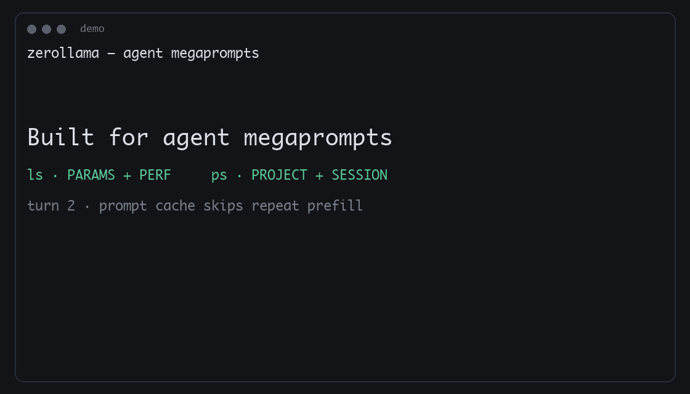

<p align="center">
  
</p>

# Zerollama

**Built for agent megaprompts — not toy chat windows.**

Your agent pastes a novel of tools and history every turn. Zerollama makes that feel fast, and can draw, clip, speak, and make snap yes/no calls on the same server — **and it’s still backwards compatible with [Ollama](https://github.com/ollama/ollama)** (same CLI, REST, and clients).

> **Not upstream Ollama.** Build from this repo (`./zerollama`), not [ollama.com/install.sh](https://ollama.com/install.sh). If you only want “pull a model and chat” once, use [upstream](https://github.com/ollama/ollama).

<p align="center">
  
</p>

## Quick start

**Apple Silicon:**

```bash
git clone <this-repo> zerollama && cd zerollama
./scripts/runtime/dev_bootstrap.sh
./zerollama serve
./zerollama pull llama3.2:3b
./zerollama run llama3.2:3b
```

**CUDA** / **Arc** → [Building](#building)

```bash
./zerollama doctor
curl -s http://127.0.0.1:11434/api/tags | jq .
```

Default listen `:11434`. Point Hermes / OpenClaw / **Grok Bot** / Open WebUI / Continue at `http://127.0.0.1:11434`.

```bash
zerollama launch claude      # Claude Code, Codex, Copilot, OpenCode, …
zerollama launch openclaw
zerollama launch hermes
# Grok Bot — set its local / OpenAI-compatible provider to http://127.0.0.1:11434
```

Same [ollama-python](https://github.com/ollama/ollama-python) / [ollama-js](https://github.com/ollama/ollama-js) clients. Community catalog: [ollama/ollama § Integrations](https://github.com/ollama/ollama#community-integrations). Cloud tags: **[Eliza Cloud](https://www.elizacloud.ai)** — [eliza-cloud.md](docs/eliza-cloud.md).

## Features

### Your agent stops re-reading the novel every turn

Huge prompts get chewed up faster (~3–7× in our labs). The next message remembers what it already read. Ask several follow-ups off the same long context without paying for that trunk again and again.

| Plain idea | Under the hood |
|------------|----------------|
| Chew huge prompts faster | Faster tokenizer ([Gigatoken](https://github.com/chynggi/gigatoken-llama.cpp)-inspired) — lab **~3–7×**; Qwen2 chat **389→81 ms** on a 1 MiB prompt |
| Remember what you already read | Sticky thread id (`prompt_cache_key`) so turn 2+ skips re-reading the shared start ([SGLang](https://github.com/sgl-project/sglang) / [vLLM](https://github.com/vllm-project/vllm)-style). Optional pin; can share one system prompt across threads |
| Keep the cache warm the right way | Chat compression (auto on tool/think threads): peel fat tool bodies from the newest end first so the shared opening stays identical; sticky `elide_from` stops the next turn from re-pasting full tools and splitting the cache |
| Many questions, one shared story | MultiDecode — keep one copy of the shared start in GPU memory and branch answers from it (`POST /v1/multidecode`). Hermes batch can do this automatically when questions share a long opening |

→ [readme-marketing-benches.md](docs/readme-marketing-benches.md) · [faster-bpe-tokenize.md](docs/faster-bpe-tokenize.md) · [gpu-profiles-l3.md](docs/gpu-profiles-l3.md) · [multidecode-llama-cpp.md](docs/multidecode-llama-cpp.md)

### Draw it, clip it, say it — same place as chat

Generate images, short videos, and spoken replies from the daemon you already pointed your agent at. No second product.

| Want | How |
|------|-----|
| Watch a clip | `video_url` / `videos[]` → ffmpeg → vision model |
| Make a video | `POST /v1/videos` — Wan, LTX, H3 families |
| Keyframes without giant JSON | `PUT /v1/media/{session}/{label}` → `options.keyframes` |
| Draw | `/v1/images/*` — MLX (Z-Image), ComfyUI, sd.cpp / OpenVINO |
| Speak / listen | `/v1/audio/speech` — Piper; remote-tts (Chatterbox / Orpheus / Kokoro / Irodori); Whisper STT |
| Song (lab) | `POST /v1/audio/generations` — Mac mlx-audio |
| Don’t kick the agent offline | Image/video gen defaults to **background** priority |

→ [wan-t2v.md](docs/wan-t2v.md) · [ltx-t2v.md](docs/ltx-t2v.md) · [h3-cuda-port.md](docs/h3-cuda-port.md) · [media-uploads.md](docs/media-uploads.md) · [music-c.md](docs/music-c.md)

### Pull names and make snap judgments

“Who’s mentioned?” “Is this urgent?” “Which of these hits is best?” as real answers — not “please reply in JSON” against the chat model.

| Want | API | Engines |
|------|-----|---------|
| Pull people / places / orgs | `POST /v1/extract` · `/v1/gliner` | GLiNER C++/ONNX |
| Yes/no, route, score | `POST /v1/decisions` · `/v1/systemone` | Laya · CLM · OpenJev (opt-in calibrated) · GLiNER-Decide |
| Rank candidates | `POST /v1/rerank` · `/api/score` | LocalAI-style control plane |

→ [gliner-cpp.md](docs/gliner-cpp.md) · [gliner-decide.md](docs/gliner-decide.md) · [laya-llama-cpp.md](docs/laya-llama-cpp.md) · [clm.md](docs/clm.md)

### One GPU, many agents, less drama

Live chat jumps ahead of background jobs. You can see *who* is holding the card. If something gets bumped, you get a reason you can retry. Training waits until things go quiet. A doctor fixes “broken” models that were really bad templates.

| Want | How |
|------|-----|
| Live work jumps the queue | `qos_class` interactive / auxiliary / background |
| See who holds the GPU | `project_id` → `zerollama ps` PROJECT/SESSION |
| Warm threads stay warm | `prompt_cache_key`, `cache_reset`, `session_parent` |
| Timeouts / kicks you can trust | HTTP **504** vs disconnect **499**; `done_reason=preempted` + reason → retry |
| Schemas that actually stick | Bound `think` + `response_format` / GBNF |
| Load / pin / batch | `/api/can-load`, `/api/propose-load`, **`POST /api/load`**, `/api/pin`, `/api/cache/pin`, Hermes batch |
| “Broken model” that’s a template | `zerollama doctor --repair-models` |
| Fine-tune without killing chat | `/api/train/*` + idle-wait / defer — submit; runs when the GPU is quiet |
| Share models across machines | `zerollama fleet serve` · `zerollama storage serve` (lab `:18090`) |

```bash
curl -s http://127.0.0.1:11434/api/version | jq '{distribution, capabilities: .zerollama.capabilities}'
```

→ [agent-qos-and-project-tracking.md](docs/agent-qos-and-project-tracking.md) · [hermes-zerollama-gap.md](docs/hermes-zerollama-gap.md) · [doctor-model-repair.md](docs/doctor-model-repair.md) · [t6-unified-queue.md](docs/t6-unified-queue.md) · [gpu-training.md](docs/gpu-training.md)

Vs upstream matrix: [upstream-ollama-diff.md](docs/upstream-ollama-diff.md)

## CLI

Richer `ls` / `ps` than upstream — MoE size, host-safe context, PERF from `bench`, and which harness holds VRAM.

```text
NAME                         ID              SIZE      PARAMS                 CTX         PERF     MODIFIED
qwen3-coder-next:6bit        ffc5c8db17e8    64 GB     15.0B MoE 512x10       80k         --       4 minutes ago
ornith-35b-optiq:latest      f4df829f8a75    22 GB     34.0B MoE 256x8        80k         54.2     12 hours ago
```

```text
NAME                       PROJECT                                       SESSION                                             SIZE     PROCESSOR    UNTIL
ornith-35b-optiq:latest    hermes-lean/discord:dm:1516015052568793098    hermes:agent:main:discord:dm:…                      27 GB    100% GPU     29 minutes from now
```

Filters: `zerollama ls image` / `zerollama ls video_gen` · docs: [bench-cache.md](docs/bench-cache.md)

## Usage

Vanilla Ollama clients work. When `distribution == "zerollama"`, send a thread id + priority so the cache and queue help:

```bash
curl http://127.0.0.1:11434/api/chat -d '{
  "model": "llama3.2:3b",
  "stream": false,
  "messages": [
    {"role": "system", "content": "You are a coding agent. (…long tools + prefs…)"},
    {"role": "user", "content": "Fix the flaky test."}
  ],
  "options": {
    "prompt_cache_key": "hermes-thread-42",
    "zerollama": {
      "qos_class": "interactive",
      "project_id": "hermes-lean",
      "project_name": "demo"
    }
  }
}'
```

```python
from ollama import chat
print(chat(model='gemma3', messages=[{'role': 'user', 'content': 'Why is the sky blue?'}]).message.content)
```

[docs.ollama.com/api](https://docs.ollama.com/api) · harness contract: [agent-qos-and-project-tracking.md](docs/agent-qos-and-project-tracking.md)

**Backends:** llama.cpp (ggml Metal/CUDA or Go→llama-server), MLX safetensors, Python runtime (`:8081`). Optional: [Flash-MoE](docs/flash-moe.md).

## Building

| Platform | Start here |
|----------|------------|
| **Apple Silicon** | [mac-dev-setup.md](docs/mac-dev-setup.md) → `./scripts/runtime/dev_bootstrap.sh` |
| **CUDA** | [cuda-lanes.md](docs/cuda-lanes.md) · [5080-runbook.md](docs/5080-runbook.md) |
| **Arc** | [a380-runbook.md](docs/a380-runbook.md) |

```bash
./scripts/build/build_zerollama_mac.sh
ZEROLLAMA_GPU_JOBS=false OLLAMA_NOPRUNE=1 ./zerollama serve
```

Vendor pin: **`f280b269` / b10615** — [runtime/LLAMA_CPP_PIN.md](runtime/LLAMA_CPP_PIN.md). After patch edits: `make -f Makefile.sync clean apply-patches && ./scripts/vendor/sync_vendor_llama.sh`.

## Documentation

[docs/README.md](docs/README.md) · [ROADMAP.md](docs/ROADMAP.md) · [CHANGELOG.md](CHANGELOG.md)

| Area | Docs |
|------|------|
| Harness / Hermes | [agent-qos-and-project-tracking.md](docs/agent-qos-and-project-tracking.md) · [hermes-zerollama-gap.md](docs/hermes-zerollama-gap.md) |
| MultiDecode | [multidecode-llama-cpp.md](docs/multidecode-llama-cpp.md) |
| Decide / extract | [laya-llama-cpp.md](docs/laya-llama-cpp.md) · [clm.md](docs/clm.md) · [gliner-cpp.md](docs/gliner-cpp.md) · [gliner-decide.md](docs/gliner-decide.md) |
| Speed | [faster-bpe-tokenize.md](docs/faster-bpe-tokenize.md) · [gpu-profiles-l3.md](docs/gpu-profiles-l3.md) |
| Media | [wan-t2v.md](docs/wan-t2v.md) · [ltx-t2v.md](docs/ltx-t2v.md) · [h3-cuda-port.md](docs/h3-cuda-port.md) · [music-c.md](docs/music-c.md) |
| Train / idle queue | [gpu-training.md](docs/gpu-training.md) · [t6-unified-queue.md](docs/t6-unified-queue.md) |
| Doctor | [model-serving-minefield.md](docs/model-serving-minefield.md) · [doctor-model-repair.md](docs/doctor-model-repair.md) |
| Storage / fleet | [remote-model-storage.md](docs/remote-model-storage.md) · [fleet-management.md](docs/fleet-management.md) |

## Agent skills

**33** [`SKILL.md`](skills/README.md) packages so Cursor / Claude / Copilot agents can use zerollama without reverse-engineering the API.

```bash
npx skills add GoodSoftware-Group/zerollama
npx skills add GoodSoftware-Group/zerollama --agent cursor
```

→ [skills/README.md](skills/README.md) · [skills/skills.json](skills/skills.json)

## Acknowledgments

We reimplement **ideas** in our Go + llama.cpp + runtime shape — we do **not** vendor their servers as required deps.

| Project | What we took |
|---------|----------------|
| **[Gigatoken](https://github.com/chynggi/gigatoken-llama.cpp)** | Fast tokenize — patches **0106–0126** |
| **[vLLM](https://github.com/vllm-project/vllm)** / **[SGLang](https://github.com/sgl-project/sglang)** | Prefix cache + agent multimodal patterns |
| **[LocalAI](https://github.com/mudler/LocalAI)** | Control-plane habits (rerank, repair, bench) |
| **[WestCoastML/multidecode](https://github.com/WestCoastML/multidecode)** | Forest decode — patches **0129–0131** |
| **[GLiNER.cpp](https://github.com/Knowledgator/GLiNER.cpp)** / **[GLiNER2.5-Decide](https://huggingface.co/fastino/GLiNER2.5-Decide)** | Extract + encoder triage |
| **[Hermes Agent](https://github.com/NousResearch/hermes-agent)** | Harness that needs a real control plane |
| **[model-serving-minefield](https://github.com/Blackwellboy/model-serving-minefield)** | Doctor trap map |
| **[ollama/ollama](https://github.com/ollama/ollama)** / **[llama.cpp](https://github.com/ggml-org/llama.cpp)** | Wire shape + engine (pin **b10615**) |

More: [open-source-shoutouts.md](docs/open-source-shoutouts.md) · [@spaceodili](https://x.com/spaceodili)

Issues and PRs welcome.

**License:** [MIT](LICENSE) (Ollama lineage).
