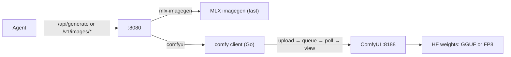

# ComfyUI image backend (agent-max utility)

## Why this backend exists

Agents need more than “prompt → PNG”: instruction edit, img2img, ControlNet, LoRA, and (later) upscale. Zerollama’s built-in MLX pipeline (`x/imagegen`, `mlx-imagegen`) is the **fast path** for Z-Image Turbo and FLUX.2 Klein (4B-shaped) — seconds on a warm GPU. Porting every new Hugging Face DiT (Qwen-Image, GLM-Image, FLUX.1/2-dev) into MLX Go would take months per family, and those models already ship mature [ComfyUI](https://github.com/comfyanonymous/ComfyUI) node graphs with the utility nodes agents need.

**Why orchestrate Comfy instead of embedding Diffusers in Python:** Comfy is the de-facto packaging layer for the tight 2026 image models (GGUF loaders, Lightning LoRAs, ControlNet packs). Reimplementing that in `runtime/` would duplicate community work and still leave agents editing raw graphs. Zerollama’s job is the **agent-facing API** (named workflows + options) and **VRAM handoff** with ggml/runtime — not owning DiT kernels.

**Why not expand `external-image`:** that hook is a raw subprocess escape hatch (`OLLAMA_EXTERNAL_IMAGE_BIN`). It has no workflow discovery, no image upload semantics, and historically skipped `PrepareForImageGen`. Comfy is the first-class utility path; `external-image` stays for one-off scripts.



Keep interactive latency on MLX (`x/z-image-turbo`, `x/flux2-klein`). Route heavy/utility models through `comfyui`.

> **The shipped `scripts/comfyui/*/*.json` graphs are worked examples, not verified-working workflows.**
>
> **Why ship examples at all:** agents and operators need a concrete template shape (`bindings` + API-format `graph`) and model presets to register. **Why they are not drop-in:** Comfy custom-node class names and checkpoint filenames drift; a graph that matches *your* install is an operator step, not something Zerollama can guarantee without bundling Comfy. Once a graph loads in Comfy’s UI (or via `POST /prompt`), the Go bindings layer needs no code changes — only node id/field fixes in the JSON.

## Architecture (code map)

| Path | Role | Why |
|------|------|-----|
| `types/model.BackendComfyUI` | Manifest driver name `comfyui` | Same modality map as Whisper/Wan — agents pick a model, not a URL. |
| `server/routes.go` → `handleComfyImageGenerate` | Route after capability `image` | Reuses `/api/generate` and OpenAI `/v1/images/*` so agents don’t learn a third API. |
| `vram.PrepareForImageGen` | Evict ggml + runtime before Comfy | Peak VRAM; same exclusive-GPU reason as MLX. Harmless if Comfy is remote. |
| `server/modality/comfyui` | HTTP client + template render | Thin; no DiT math in Go. |
| `scripts/comfyui/<model>/*.json` | Named workflows (`t2i`, `edit`, …) | Agents pass `options.workflow`; bindings hide Comfy node ids. |
| `modelfiles/comfy-*/config.json` | Config-only manifests | Weights live in Comfy’s `models/` tree (Wan-style) — Ollama blobs would duplicate multi‑GB checkpoints. |
| `GET /api/image/workflows` | Discovery | Agents list required fields before guessing. |

### Request flow

1. Client hits `/api/generate` or `/v1/images/generations|edits` with a `comfy/*` model.
2. `handleImageGenerate` sees `modality_backends.image=comfyui` → `PrepareForImageGen` → `handleComfyImageGenerate`.
3. Go resolves `backend_paths.comfy_workflow_dir`, loads `<workflow>.json`, uploads reference/control images to Comfy `/upload/image`.
4. Template `Render` injects prompt/seed/size/lora/control at **bound** node inputs (**why bindings:** every graph has different node ids; agents must not hardcode Comfy JSON).
5. `POST /prompt` → poll `/history/{id}` → `GET /view` → base64 PNG in `GenerateResponse.image`.

**Why poll history instead of WebSocket:** same reliability for a fire-and-forget agent client; minutes-long GLM/FLUX.2 jobs are bounded by `OLLAMA_COMFYUI_TIMEOUT`, not by a socket stuck in the broker. WebSocket progress can be added later without changing the agent API.

**Why client disconnect does not cancel Comfy (today):** `/interrupt` is a follow-up. Cancelling the HTTP poll stops waiting; GPU work may continue until Comfy finishes or the timeout elapses. Prefer short timeouts in exploratory smoke; production agents should treat Comfy jobs as best-effort async work.

## Setup

1. Install and run [ComfyUI](https://github.com/comfyanonymous/ComfyUI). For GGUF on 16 GB cards, install [ComfyUI-GGUF](https://github.com/city96/ComfyUI-GGUF) custom nodes.
2. Download weights into ComfyUI’s `models/` tree — Zerollama does not manage or blob those files.
3. Env (optional):
   - `OLLAMA_COMFYUI_URL` (default `http://127.0.0.1:8188`)
   - `OLLAMA_COMFYUI_TIMEOUT` (default `10m` — **why generous:** Qwen/FLUX.2/GLM on 16 GB can take minutes)
   - `OLLAMA_COMFYUI_WORKFLOWS_ROOT` — **why:** shipped manifests use relative `scripts/comfyui/...`; if `zerollama serve` is not started from the repo root, join relative dirs against this root (or put absolute/`~/` paths in the manifest)
4. Register config-only presets:

   ```bash
   ./scripts/register_comfy_models.sh
   # or one model:
   ./scripts/register_comfy_models.sh comfy/qwen-image modelfiles/comfy-qwen-image/config.json
   ```

5. Calibrate each workflow JSON against your Comfy install, then:

   ```bash
   zerollama run comfy/qwen-image "a watercolor fox in a forest"
   ```

## Model set

| Model | Workflows shipped | Notes |
|-------|-------------------|-------|
| `comfy/qwen-image` | `t2i`, `img2img`, `controlnet` | GGUF Q4/Q5 default for 16 GB. No default LoRA node (**why:** a fake `none.safetensors` fails Comfy load). |
| `comfy/qwen-image-edit` | `edit` | Instruction edit; Lightning LoRA filename in graph when installed. Prompt binds to the edit text-encode node, not a unused CLIP node. |
| `comfy/flux1-dev` | `t2i` | FP8 or GGUF quant. |
| `comfy/flux2-dev` | `t2i` | Low-bit GGUF; expect multi-minute gens on 16 GB. |
| `comfy/glm-image` | `t2i` | Heavy — treat as async/offload on 16 GB. |
| `comfy/flux2-klein-9b` | `t2i` | MLX Klein path stays 4B-shaped; 9B goes through Comfy. |

## Agent-facing API

**Why these fields and not raw Comfy JSON:** agents should select *capability* (`t2i` vs `edit` vs `controlnet`) and pass prompts/images; node graphs stay operator-owned under `scripts/comfyui/`.

| Field | Meaning |
|-------|---------|
| `prompt` | Positive prompt. |
| `images[0]` / `/v1/images/edits` `image` | Reference/edit input → Comfy `LoadImage`. |
| `options.workflow` | Named template; default = `comfy_default_workflow` then `t2i`. |
| `options.negative_prompt` | When the workflow binds a negative slot. |
| `width`, `height`, `steps`, `seed` | Same top-level shape as MLX imagegen. |
| `options.lora` / `options.lora_strength` | Only when the template binds LoRA slots. |
| `options.control_image` (raw base64) / `options.control_strength` | When `workflow=controlnet`. |

Discovery:

```
GET /api/image/workflows?model=comfy/qwen-image
```

```json
{
  "model": "comfy/qwen-image",
  "default": "t2i",
  "workflows": [
    {"name": "t2i", "fields": ["prompt", "negative_prompt", "seed", "steps", "width", "height"]},
    {"name": "img2img", "requires": ["prompt", "image"], "fields": ["..."]},
    {"name": "controlnet", "requires": ["prompt", "control_image"], "fields": ["..."]}
  ]
}
```

**Why a discovery route:** tool-using agents can probe required inputs before a failed 10‑minute queue.

## Design notes (WHY)

- **Exclusive GPU via `PrepareForImageGen`:** diffusion can fill a 16 GB card; leaving ggml/`llama-server` resident causes OOM. Eviction runs even when Comfy is remote — slight overkill, safer default than silent dual occupancy.
- **Config-only manifests:** same pattern as Wan — Ollama registry names + capabilities without duplicating multi‑GB weights into blobs.
- **Bindings map:** keeps agent options stable when operators renumber Comfy nodes.
- **No default LoRA stub files:** Comfy rejects missing LoRA paths; optional LoRA is “add a node + bind fields,” not `"none.safetensors"`.
- **Execution errors from history:** Comfy often returns HTTP 200 on `/prompt` then fails at runtime with `status_str: "error"`; surfacing `execution_error` (node type + exception) is the only way agents/operators see real failures.
- **Non-goals:** bundling ComfyUI in the Go binary; porting Qwen/GLM/FLUX.1 DiTs into `x/imagegen`; interactive-speed guarantees for GLM-Image / FLUX.2-dev on 16 GB.

## Tests

- Unit: `go test ./server/modality/comfyui/...` — template render, mock Comfy HTTP, path resolution, execution-error parsing.
- Opt-in E2E: `RUN_E2E_COMFY=1 COMFY_E2E_WORKFLOW_DIR=... go test ./server/modality/comfyui/... -run TestE2ESmoke -v`

## Cookbook

**Text-to-image**

```bash
curl -s localhost:8080/api/generate -d '{
  "model": "comfy/qwen-image",
  "prompt": "a fox in snow, watercolor",
  "stream": false,
  "width": 1024, "height": 1024,
  "options": { "seed": 42, "workflow": "t2i" }
}'
```

**Edit** (image required)

```bash
curl -s localhost:8080/v1/images/edits -d "{
  \"model\": \"comfy/qwen-image-edit\",
  \"prompt\": \"make the sky sunset orange\",
  \"image\": \"data:image/png;base64,$(base64 -w0 ref.png)\"
}"
```

**ControlNet**

```bash
curl -s localhost:8080/api/generate -d "{
  \"model\": \"comfy/qwen-image\",
  \"prompt\": \"industrial robot, cinema lighting\",
  \"stream\": false,
  \"options\": {
    \"workflow\": \"controlnet\",
    \"control_image\": \"$(base64 -w0 edges.png)\",
    \"control_strength\": 0.8
  }
}"
```
