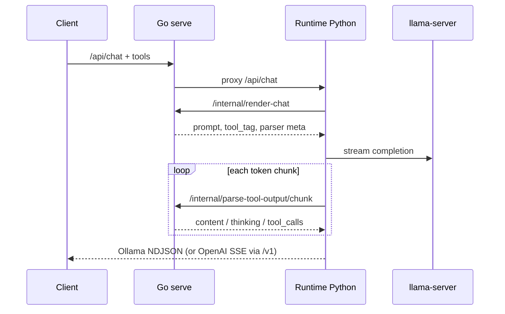

# Handoff: Phase 12 runtime tools + Phase 11/13 GPU policy + Phase 14 forward + 5080 operator gate

**Audience:** Another engineer with access to this repo who did not participate in the design and implementation thread.

**Purpose:** Capture **intent**, **architecture**, **code locations**, **operational knobs**, and **known gaps** for:

1. **Phase 12** — runtime-default text inference with tools (Go render/parse parity with ggml).
2. **Phase 11** — opinionated Python VRAM + inference-first admission on shared GPUs.
3. **Phase 13** — VRAM estimates, autotune, optional clamp, single-GPU autoconfig.
4. **Phase 14** — in-process llama forward + render tokenize (see dedicated handoff).
5. **5080 operator gate** — repeatable GPU session, API ggml unload, snapshot + recommendations.

**Status (Jun 2026):**

| Phase | ROADMAP | Tests / smoke |
|-------|---------|----------------|
| **12** tools path | **Done** | Go Golden (`phase12_golden_ci.sh`); runtime pytest tools meta. **Harmony real weights:** CI synthetic only — not required on 5080 (~19 GiB host RAM). |
| **11** admission | **Partial** — logic + YAML `vram:` defaults on `single_gpu.yaml` | **410+** runtime pytest; `e2e_coordination_smoke.sh`; 5080 session: gates active, admission fits at smoke load |
| **13** VRAM estimates | **Partial** | autotune, clamp default **off** in YAML, `gpu_snapshot`, `vram_yaml_defaults`; [phase13-runtime-vram.md](./phase13-runtime-vram.md) |
| **14** in-process llama | **Done** | `phase14_5080_signoff.sh` PASS. [handoff-phase14-inprocess-llama.md](./handoff-phase14-inprocess-llama.md) |
| **15** native KV | **Partial (v0–v8 ops)** | `phase15_kv_native_ci.sh` (CPU); `phase15_inprocess_signoff.sh` (GPU). [handoff-phase15-native-kv.md](./handoff-phase15-native-kv.md) |
| **5080 gate** | **Shipped (ops)** | `./scripts/gpu_5080_session.sh` PASS on RTX 5080-class host; [gpu-5080-operator-guide.md](./gpu-5080-operator-guide.md) |

Run **Go tests on the target host** (`go test ./server/... ./x/runtimeworker/... ./x/trainingworker/...`). **Single-GPU acceptance:** `./scripts/gpu_5080_session.sh` after rebuild/restart with smoke GGUF + `LLAMA_SERVER_BIN`.

---

## Documentation index (read these first)

| Doc | Why |
|-----|-----|
| **[phase11-runtime-admission.md](./phase11-runtime-admission.md)** | Phase 11 WHY, two env knobs, priority classes, enqueue/dequeue flow, `/health` gates |
| [scheduling-vram-policy.md](./scheduling-vram-policy.md) | Full Go+Python stack (broker, T6 defer, Phase 13 estimate envs) |
| [phase13-runtime-vram.md](./phase13-runtime-vram.md) | Phase 13 WHY: suggest, clamp, autotune, operator CLI, 5080 workflow |
| [gpu-5080-operator-guide.md](./gpu-5080-operator-guide.md) | Single-GPU gate: session script, API unload, snapshot, harmony/host-RAM limits |
| [runtime/docs/OPERATIONS.md](../runtime/docs/OPERATIONS.md) | `/health` fields, serve options |
| [testing-smoke.md](./testing-smoke.md) | GPU e2e for runtime + ggml |
| [CHANGELOG.md](../CHANGELOG.md) | Unreleased Phase 11/12/13 + GPU smoke entries |
| [handoff-gpu-training-integration.md](./handoff-gpu-training-integration.md) | Embedded training; interacts with Phase 11 reserve |
| **[handoff-phase14-inprocess-llama.md](./handoff-phase14-inprocess-llama.md)** | Phase 14 forward backends, tokenize, smokes, bugs fixed |
| [phase14-inprocess-llama.md](./phase14-inprocess-llama.md) | Operator guide (WHY-oriented) |
| [runtime/configs/single_gpu.yaml](../runtime/configs/single_gpu.yaml) | 16GB topology + `vram:` defaults (applied when env unset) |

---

## Quick start (5080-class GPU host)

**Why one command:** CI proves parsers without a GPU; production single-GPU hosts need the same evidence chain (golden → coordination → runtime+proxy e2e → calibration JSON → env hints).

```bash
export OLLAMA_HOST=http://127.0.0.1:8080
export LLAMA_SERVER_BIN=/usr/bin/llama-server
export LLAMA_MODEL=/path/to/small-smoke.gguf   # e.g. 1B Q8
export RUN_E2E_GGUF=$LLAMA_MODEL
export RUN_E2E_PROXY_MODEL=llama3.2:3B          # optional
cd /root/zerollama && ./scripts/gpu_5080_session.sh
```

**Do not block release on:** `gpu_harmony_capture.sh` / `gpt-oss:20b` on ~19 GiB host RAM — use `phase12_golden_ci.sh` for Harmony parser coverage.

---

# Part A — Phase 12 (runtime tools)

## What we were solving

**Goal:** Route plain **text** chat (including **tools**) through the Python **`runtime/`** + `llama-server` path by default, while **vision**, **logprobs**, and **think** stay on the **ggml** runner.

**Why split render/parse to Go:** Modelfile templates and family tool parsers (`model/parsers/*`, `tools.Parser`) already live in the Go daemon. Reimplementing Harmony/Gemma/etc. in Python would drift from ggml behavior. Loopback **internal** HTTP keeps a single source of truth.

| Stage | Deliverable |
|-------|-------------|
| **Q1–Q2** | Python `tools_parser` + `chat_tools`; Go stops forcing legacy for tools-only chat; runtime proxy forwards `/api/chat`. |
| **Q3** | `POST /internal/render-chat` — prompt + `tool_tag` + parser metadata; Python `resolve_tools_chat_prompt` with `num_ctx`. |
| **Q4** | Stateful streaming parse: `parse-tool-output/session` + `chunk` + `close`; `GoToolParseStreamSession`. |
| **Audit** | No silent fallback to JSON parser when a **family** parser is required; chunk-failure → buffer + one-shot parse; session caps in Go. |

## Architecture (tools on runtime path)

```text
Client → zerollama serve (Go)
           ├─ routing: runtime-default for text GGUF (tools OK)
           └─ proxy → Python runtime :8081
                    ├─ POST /internal/render-chat     (Go, loopback)
                    ├─ llama-server completion stream
                    └─ POST /internal/parse-tool-output/*
                         session → chunk* → close   (Go, loopback)
```



**Still on ggml runner:** vision, logprobs, think, MLX, models without `zerollama-runtime` backend. **Tools** on runtime-routed text models use Go render/parse (Phase 12 — [ROADMAP.md](./ROADMAP.md) updated).

## Request routing

| Feature | Runtime Python | ggml Go runner |
|---------|----------------|----------------|
| Plain text chat | Yes (default) | Legacy flags / no runtime backend |
| Tools (builtin `parser`) | Yes — Go render + parse | If vision/logprobs/think |
| Tools (template JSON only) | Yes — Go render | Same |
| Vision / logprobs / think | No | Yes |

**Go:** `chatNeedsLegacyRunner` — tools alone do **not** force legacy.  
**Python:** `runtime/server/runtime_chat.py` — `chat_needs_legacy()` ignores `tools`.

## Internal Go APIs (loopback)

All under `internalLoopbackOnly()` in [server/routes.go](../server/routes.go).

| Method | Path | Role |
|--------|------|------|
| POST | `/internal/render-chat` | Prompt + `tool_tag` + parser metadata |
| POST | `/internal/parse-tool-output` | One-shot parse |
| POST | `/internal/parse-tool-output/session` | Open stateful parser |
| POST | `/internal/parse-tool-output/chunk` | Stream chunks |
| POST | `/internal/parse-tool-output/close` | Drop session |
| POST | `/internal/go-coordination` | Queue mirrors for Phase 11 |
| POST | `/internal/training-gpu-busy` | Training reserve signal (Phase 11) |
| POST | `/internal/cross-queue-seq` | Global FIFO tickets (T6) |

**Parse sessions:** [server/runtime_tool_parse_session.go](../server/runtime_tool_parse_session.go) — TTL 10m, max 256 sessions → 503.

**Render:** [server/runtime_render_chat.go](../server/runtime_render_chat.go) — truncation when `num_ctx` set: **`truncate_mode: tokenize`** if a ggml runner for the model is already loaded (same loop as `chatPrompt`, budget = `num_ctx` minus `num_predict` reserve — stricter than ggml chat’s full-`NumCtx` check); else **`heuristic`** (~len/4). **`truncated: true`** only when prefix messages were dropped (`truncated` is not “truncation enabled”). Runtime-only loads usually get heuristic until a legacy runner is warm.

## Phase 12 env (tools / Go loopback)

| Variable | Default | Meaning |
|----------|---------|---------|
| `ZEROLLAMA_RUNTIME_GO_RENDER_CHAT` | `auto` | `off` disables Go render/parse |
| `ZEROLLAMA_GO_URL` | auto from `OLLAMA_HOST` | Go base for loopback (maps `0.0.0.0` → `127.0.0.1` in Python) |

Host RAM / VRAM: see **Part B** and [phase11-runtime-admission.md](./phase11-runtime-admission.md).

## Phase 12 — error handling

**`ToolParseUnavailableError`** when family parser required and Go parse fails. **503** / stream error JSON. No silent fallback to Python JSON parser after family-formatted prompt.

## Phase 12 — code map (Go)

| Layer | Path |
|--------|------|
| Internal routes | `server/routes.go` |
| Render / parse | `server/runtime_render_chat.go`, `server/runtime_tool_parse_session.go` |
| Proxies | `server/runtime_chat_proxy.go`, `server/runtime_v1_chat_proxy.go` |
| Default routing | `server/runtime_inference_routing.go` |
| VRAM broker | `server/vram/broker.go` |
| Training GPU busy | `server/training_policy.go` |
| Tests | `server/runtime_tool_parse_session_test.go`, `server/runtime_render_chat_test.go`, `server/runtime_render_golden_test.go`, `server/runtime_parse_golden_test.go` |

## Phase 12 — code map (Python tools)

| Module | Path |
|--------|------|
| Go render | `runtime/runtime/go_render_chat.py` |
| Go parse stream | `runtime/runtime/go_parse_tool_output.py` |
| Chat + tools | `runtime/runtime/server/chat_tools.py`, `app.py`, `openai_v1.py` |
| Tests | `runtime/tests/test_tools_parser.py`, `test_go_parse_*.py`, `test_tool_parse_hardening.py` |

---

# Part B — Phase 11 (GPU admission)

## Why (one paragraph)

On a single GPU, **chat**, **batch runtime work**, **ggml runners**, and **training** share VRAM. Phase 8 (Go broker) evicts proactively; Phase 11 ensures the **Python runtime** does not accept work it cannot run **before** KV allocation and `llama-server` start, and throttles **batch (`priority: low`)** when Go mirrors show defer/ggml/backlog pressure—**without** a dozen `ADMISSION_*` env flags.

**Product decision:** tune backlog thresholds in code after measurement under **real** chat+training load. **VRAM headroom** (min-free, training reserve) may be set via env **or** `single_gpu.yaml` `vram:` block — **why:** 16GB autoconfig installs should not require duplicating `1GiB`/`2GiB` in every systemd unit.

## YAML defaults (`single_gpu.yaml` → env)

Applied at runtime start by `vram_yaml_defaults.py` when env is **unset** (embed + sidecar via `create_app()` / CLI):

| YAML key | Default | Env |
|----------|---------|-----|
| `min_free` | `1GiB` | `ZEROLLAMA_RUNTIME_VRAM_MIN_FREE` |
| `training_reserve` | `2GiB` | `ZEROLLAMA_RUNTIME_TRAINING_VRAM_RESERVE` |
| `estimate_factor_autotune` | `auto` | `ZEROLLAMA_RUNTIME_VRAM_ESTIMATE_FACTOR_AUTOTUNE` |
| `probe_calibrate` | `auto` | `ZEROLLAMA_RUNTIME_VRAM_PROBE_CALIBRATE` |
| `clamp_num_ctx` | `"0"` | `ZEROLLAMA_RUNTIME_VRAM_CLAMP_NUM_CTX` (**off** — why: silent ctx cut) |

Optional backlog overrides remain env-only: `ZEROLLAMA_RUNTIME_BACKLOG_BATCH_MIN`, etc. — see [phase11-runtime-admission.md](./phase11-runtime-admission.md).

## Operator env (policy only)

| Variable | Role |
|----------|------|
| `ZEROLLAMA_RUNTIME_INFERENCE_POLICY=off` | Disable defer/ggml/backlog throttling for **`priority: low` only** |
| `ZEROLLAMA_RUNTIME_CHECK_GPU_VRAM=0` | Disable host + GPU budget + 1 GiB floor |
| `ZEROLLAMA_RUNTIME_MAX_QUEUE` | Optional waiting-queue cap (default **512** in code) |

**Independent:** `INFERENCE_POLICY=off` does **not** disable VRAM checks. `CHECK_GPU_VRAM=0` disables VRAM but leaves inference-first on.

**Removed (no longer read):** `ZEROLLAMA_RUNTIME_ADMISSION_*`, `TRAINING_VRAM_RESERVE`, `ADMISSION_VRAM_BYPASS_PRIORITY`, per-gate `ADMISSION_DEFER_BACKLOG`, etc. See [CHANGELOG.md](../CHANGELOG.md) Unreleased → Changed.

## Constants in code (tune here)

| Constant | Location | Default |
|----------|----------|---------|
| `TRAINING_VRAM_RESERVE_BYTES` | `admission.py` | 2 GiB |
| `VRAM_MIN_FREE_DEFAULT_BYTES` | `inference_policy.py` | 1 GiB |
| `LOW_PRIORITY_VRAM_FACTOR` | `inference_policy.py` | 1.5× |
| `RUNTIME_BACKLOG_BATCH_MIN` | `inference_policy.py` | 4 |
| `DEFER_WAITING_MIN`, `GGML_SCHED_BACKLOG_MIN` | `inference_policy.py` | 1 |

## Priority (`options.priority`)

| Priority | Enqueue under defer/ggml/backlog | VRAM min-free gate | Queue |
|----------|----------------------------------|--------------------|-------|
| `high` / `interactive` | Allowed | Bypassed | Front |
| `normal` (default) | Allowed | Standard | FIFO |
| `low` / `batch` | Rejected when mirrors busy | 1.5× floor | FIFO; `generate_batch` defaults here |

**Dequeue:** only **`low`** at queue **head** stalls under inference-first; **`normal` keeps running** (fixed May 2026 — had briefly stalled all non-high).

## Admission flow (Python)

```text
submit (_admit_one / generate_batch)
  ├─ check_admit: paused? queue full? inference-first (LOW only)? generic 1 GiB if no GGUF path
  └─ _vram_precheck_enqueue: host + check_gguf_vram_budget (if GGUF known; skip if same model+ctx loaded)

scheduler tick (dequeue)
  ├─ check_admit again + _vram_precheck_load
  └─ pop_waiting_for_tick: HIGH always; LOW stalls if pressure; NORMAL runs
```

**Why enqueue + dequeue:** VRAM can drop while waiting. **Why `max(model, min_free)` in `check_gguf_vram_budget`:** one check when GGUF path known; avoids duplicate 1 GiB probe.

## Go ↔ Python coordination

| Mechanism | Why |
|-----------|-----|
| `POST /internal/go-coordination` | defer_waiting, ggml sched, `ggml_loads_paused`, runtime mirror |
| `POST /internal/training-gpu-busy` | **Authoritative** 2 GiB reserve while training on GPU |
| Stale mirror TTL (30s) | fail-open on mirrored metrics if Go push fails |
| `e2e_coordination_smoke.sh` | Quick `/health` check without full GPU infer |

## `/health` admission (post-rebuild)

| Field | Meaning |
|-------|---------|
| `gates_active.low_would_wait` | Metrics say **low** should wait |
| `gates_active.runtime_backlog_pressure` | backlog ≥ 4 — **does not block normal** |
| `gates_active_compat` | Legacy names (`batch_backpressure`, …) |

If smoke shows only `batch_backpressure` under `gates_active`, **rebuild/restart** zerollama (old binary).

## Phase 11 — code map (Python)

| Layer | Path |
|--------|------|
| Admission API | `runtime/runtime/gpu/admission.py` |
| Thresholds / backpressure | `runtime/runtime/gpu/inference_policy.py` (optional env overrides) |
| YAML → env at start | `runtime/runtime/vram_yaml_defaults.py` |
| Priority | `runtime/runtime/gpu/priority.py` |
| VRAM probe + budget | `runtime/runtime/gpu_vram.py`, `gguf_estimate.py`, `host_memory.py` |
| Enqueue/dequeue | `runtime/runtime/engine.py` |
| Coordinator + health | `runtime/runtime/gpu/mutex.py` |
| Dequeue pop | `runtime/runtime/scheduler/scheduler.py`, `loop.py` |
| Go mirror | `runtime/runtime/go_coordination.py` |
| Tests | `test_admission.py`, `test_inference_policy.py`, `test_scheduler_low_dequeue.py`, `test_admit_vram_precheck.py`, `test_gpu_vram.py`, `test_mutex.py` |
| Go VRAM probe | `internal/runtimeclient/vram_estimate.go` |
| Go v1 proxy options | `server/runtime_manifest.go` (`runtimeV1ProxyOptions`), `server/runtime_v1_chat_proxy.go` |

Phase 13 estimate envs (`VRAM_MARGIN`, autotune, …): **not** Phase 11 — [phase13-runtime-vram.md](./phase13-runtime-vram.md).

---

# Part C — Phase 13 (runtime VRAM estimates)

## What we were solving

**Goal:** On single-GPU hosts, answer **“will this GGUF fit at this `num_ctx`?”** before `llama-server` starts, and optionally **lower `num_ctx`** when estimates say the request is over budget.

**Why not only Phase 11:** admission decides **who** waits; Phase 13 decides **how large** the model budget is. Different failure modes (false reject vs OOM) need different tuning surfaces.

## Key mechanisms

| Mechanism | Why |
|-----------|-----|
| `suggest_max_num_ctx` | Binary search using same `check_gguf_vram_budget` math as enqueue. |
| `VRAM_CLAMP_NUM_CTX` default **off** | Silent context reduction broke operator trust; `auto`/`1` opt in. |
| `resolve_num_ctx_for_request` | One path for render, precheck, queue, and `-c` (fixes tools + load drift). |
| `vram_num_ctx` on API | Clients see when clamp ran (`num_ctx_clamped_from`, effective `num_ctx`). |
| `runtime_vram_estimate.sh` | Operator pre-flight without load. |
| Autotune + probe calibrate | Per-GGUF factors; `vram_calibration.suggested_estimate_factor` after real load. |

## Phase 13 — code map

| Layer | Path |
|--------|------|
| Suggest / clamp / API meta | `runtime/runtime/vram_suggest.py` |
| Budget + estimate | `runtime/runtime/gpu_vram.py`, `gguf_estimate.py` |
| Admit ctx | `runtime/runtime/engine.py` (`resolve_num_ctx_for_request`) |
| HTTP | `runtime/runtime/server/app.py` (`_request_num_ctx`), `openai_v1.py` (`prepare_v1_chat`) |
| Tools stream | `runtime/runtime/server/chat_tools.py` |
| Autoconfig | `runtime/runtime/autoconfig.py`, `configs/single_gpu.yaml` |
| Snapshot → hints | `runtime/runtime/gpu_snapshot.py` (`python -m runtime.gpu_snapshot`) |
| Health formatting | `runtime/runtime/gpu_health_report.py` |
| Go probe | `internal/runtimeclient/vram_estimate.go` |
| CLI | `scripts/runtime_vram_estimate.sh`, `scripts/gpu_phase13_snapshot.sh` |

**5080 session artifact:** `GPU_PHASE13_SNAPSHOT_OUT` (default `/tmp/5080-session.json`) includes `vram_autotune.persist` — **why:** recommendations distinguish “autotune already seeded for this GGUF” vs “export global factor”.

---

# Part D — GPU smokes & VRAM prep (5080)

## Why this layer exists

Phase 8 broker evicts ggml when a **runtime-proxy** `/api/generate` reaches Go. Smokes failed when:

1. Go returned **503** (training busy / admission) **before** the broker ran, leaving a stale `zerollama runner` process.
2. Operators used **`pkill`** — races loads and does not match public unload API.
3. **`pgrep -f "zerollama runner"`** matched shell test commands and looked like unload failed.

**Solution:** `scripts/runtime_smoke_lib.sh` — shared by `gpu_smoke_all.sh`, `e2e_runtime_smoke.sh`, `gpu_harmony_capture.sh`, `gpu_5080_session.sh`.

## `smoke_unload_ggml_runners`

| Step | Why |
|------|-----|
| `smoke_ggml_runner_running` → `pgrep -f '/zerollama runner --'` | Match child only, not shell snippets. |
| `GET /api/ps` → `mapfile` one model per line | Safe tags; fallback `RUN_E2E_UNLOAD_MODEL` / `RUN_E2E_LEGACY_MODEL`. |
| `POST /api/generate` `prompt:""` `keep_alive:0` | Same contract as [testing-smoke.md](./testing-smoke.md) manual unload. |
| Wait `SMOKE_UNLOAD_MAX_WAIT` (default **30**) | Large models tear down slowly after HTTP 200. |

## `smoke_prepare_vram_for_runtime`

```text
if ggml child running → smoke_unload_ggml_runners (best effort)
POST /api/generate + X-Zerollama-Runtime: 1  → Phase 8 broker
if 503 && ggml still loaded → unload again, runtime_resume_if_needed, broker retry once
if 503 && ggml still loaded → FAIL (broker never effective)
runtime_resume_if_needed
```

**Legacy ordering:** `gpu_smoke_all.sh` runs runtime+proxy first; legacy ggml only via `RUN_E2E_LEGACY_ONLY=1`. **Do not** set `RUN_E2E_LEGACY=1` with `RUN_E2E_GPU=1` on one `e2e_runtime_smoke.sh` — script errors with a hint.

## Smoke script map

| Script | Role |
|--------|------|
| `runtime_smoke_lib.sh` | Unload, resume, VRAM prep (source only) |
| `gpu_smoke_all.sh` | Coordination + VRAM prep + `RUN_E2E_GPU` + `RUN_E2E_PROXY` + health report |
| `gpu_5080_session.sh` | `RUN_E2E_PREFLIGHT=1` + `gpu_smoke_all` + snapshot + `gpu_snapshot` hints |
| `phase12_golden_ci.sh` | `check_gpu_scripts` + Go Golden + tools meta pytest (**no GPU**) |
| `gpu_phase13_snapshot.sh` | `/health` + optional `/internal/vram-estimate` JSON; inline recommend |
| `gpu_health_report.sh` | Live `/health` tuning lines |
| `check_gpu_scripts.sh` | CI: `bash -n` + import checks |
| `gpu_harmony_capture.sh` | **Optional** real-weight harmony — large **host** RAM only |
| `gpu_clamp_smoke.sh` | Serve must enable `VRAM_CLAMP_NUM_CTX=auto` |

---

# Sanity-check

## Unit tests

```bash
cd runtime && PYTHONPATH=. python3 -m pytest tests/ -q --ignore=tests/test_supervisor.py
# Expect: 284+ passed (May 2026; drifts with new tests)

go test ./server/... ./envconfig/... ./internal/runtimeclient/...
# Run on GPU host / CI
```

## Smokes

```bash
# No GPU — CI gate
./scripts/phase12_golden_ci.sh                  # check_gpu_scripts + Go Golden + tools meta pytest
./scripts/check_gpu_scripts.sh

# Phase 11 mirrors + admission (no infer)
ZEROLLAMA_RUNTIME_URL=http://127.0.0.1:8081 ./scripts/e2e_coordination_smoke.sh

# Official 16GB gate (preflight + full GPU smokes + snapshot + hints)
export LLAMA_MODEL=... LLAMA_SERVER_BIN=... RUN_E2E_GGUF=$LLAMA_MODEL
./scripts/gpu_5080_session.sh

# Full GPU runtime + optional proxy (see testing-smoke.md)
RUN_E2E_GPU=1 ./scripts/e2e_runtime_smoke.sh   # generate/chat/v1 + stream on :8081
RUN_E2E_PROXY=1 ./scripts/e2e_runtime_smoke.sh # same via :8080 proxy
RUN_E2E_TOOLS=1 RUN_E2E_GPU=1 ./scripts/e2e_runtime_smoke.sh  # tools on :8081 + proxy when RUN_E2E_PROXY=1
./scripts/gpu_smoke_all.sh                     # coordination + VRAM prep + GPU + proxy
RUN_E2E_TOOLS=1 ./scripts/gpu_smoke_all.sh     # full smoke + tools

# After session — read hints without live server
python3 -m runtime.gpu_snapshot /tmp/5080-session.json   # from runtime/ with PYTHONPATH=.
```

**VRAM prep env:** `RUN_E2E_UNLOAD_MODEL`, `SMOKE_UNLOAD_MAX_WAIT`, `RUN_E2E_NUM_CTX` (default 4096 in e2e).

## Manual — Phase 12 tools

1. `zerollama serve` + a **small** runtime-routed model with tools support (not necessarily `gpt-oss:20b` on tight host RAM).
2. `POST /api/chat` + tools + `stream: true` via `:8080`.
3. Compare tool_calls to ggml path (optional).
4. **Harmony parser:** `go test ./server/... -run TestGoldenHarmonyParseToolOutput` — no GPU weights required.

## Manual — Phase 11 admission

1. `GET :8081/health` → `admission.gates_active`, `vram_budget`, `go_coordination`.
2. Submit batch with `options.priority: batch` while ggml busy → expect reject or stall for low only.
3. `priority: high` should jump queue under backlog (see `test_scheduler_low_dequeue.py`).

---

# Known gaps / watch list

| Item | Severity | Notes |
|------|----------|--------|
| Render truncation | **Addressed (Phase 14)** | Runtime/embed: `truncate_mode=tokenize` via `/internal/tokenize` when no ggml runner. Still heuristic if runtime down. ggml path unchanged. |
| Per-chunk parse HTTP | Low | Unchanged; not Phase 14 scope |
| VRAM estimates | Medium | Heuristic; autotune on GPU; reject errors include `suggested_max_num_ctx` hint |
| Backlog thresholds under load | Ops | 5080 session proves idle smoke fits; defer/ggml backlog env overrides still unmeasured under heavy chat+training |
| VRAM headroom | Low | `single_gpu.yaml` + env; 5080 snapshot records `vram_*_configured` — tune only if real load disagrees |
| Smoke GGUF vs production autotune | Ops | OuteTTS Q8 ~1.20× is smoke evidence; run session or load on **production** GGUF (e.g. supernova fp16) for persist |
| Harmony smoke on real weights | N/A on 5080 | **Why not required:** `gpt-oss:20b` ~40+ GiB host RAM on runtime path. CI: `TestGoldenHarmonyParseToolOutput`. Optional: `gpu_harmony_capture.sh` on large-RAM hosts. [gpu-5080-operator-guide.md](./gpu-5080-operator-guide.md) |
| `gates_active` v1 keys | Ops | Shipped in `mutex.py` (`low_would_wait`, …); old daemons show `gates_active_compat` only — rebuild/restart |
| Clamp smoke vs production | Ops | `gpu_clamp_smoke.sh` proves clamp **enabled** on serve; does not prove every request was clamped |

---

# Suggested next steps

**Short (every GPU host change):**

1. **Rebuild/restart** `zerollama serve`, then `./scripts/gpu_5080_session.sh` (or at minimum `./scripts/phase12_golden_ci.sh` + `./scripts/gpu_smoke_all.sh`).
2. `go test ./server/...` on the host; CI runs Golden via regression workflow.
3. Optional: `RUN_E2E_TOOLS=1` on `gpu_smoke_all` — tools on `:8081` and `:8080` proxy (not legacy 501).
4. Read `/tmp/5080-session.json` + `python -m runtime.gpu_snapshot` — **why:** per-GGUF autotune persist beats copying smoke `VRAM_ESTIMATE_FACTOR` globally.
5. Training: [handoff-gpu-training-integration.md](./handoff-gpu-training-integration.md) + `e2e_training_ops_smoke.sh`.

**Medium (production tuning):**

1. One probed load per **production** GGUF on serve — seed `~/.cache/zerollama/vram_autotune.json`.
2. Phase 11: if chat+training together exhaust VRAM, measure and set backlog env overrides (`ZEROLLAMA_RUNTIME_BACKLOG_BATCH_MIN`, …) — idle 5080 session does not replace that.
3. Phase 13: enable `VRAM_CLAMP_NUM_CTX=auto` on serve only if automatic `num_ctx` lowering is acceptable; watch API `vram_num_ctx`.
4. **Phase 14** — maintain inprocess smoke on llama.cpp bumps; see [handoff-phase14-inprocess-llama.md](./handoff-phase14-inprocess-llama.md).
5. **Phase 15** — native KV **Partial (v0–v8 ops)** — bind, tick/decode hooks, forward plans, GPU `phase15_inprocess_signoff.sh`; next: tensor page bind — [phase15-native-kv.md](./phase15-native-kv.md), [handoff-phase15-native-kv.md](./handoff-phase15-native-kv.md).

**Non-goals:** Vision/logprobs/think on runtime; public `/api/runtime/unload`; RadixAttention v1; **mandatory** `gpt-oss:20b` harmony capture on 5080-class host RAM.

---

# Related docs

| Doc | Role |
|-----|------|
| [ROADMAP.md](./ROADMAP.md) | Phases 8–16 |
| [gpu-5080-operator-guide.md](./gpu-5080-operator-guide.md) | **WHY** 5080 session, unload, snapshot, harmony limits |
| [phase11-runtime-admission.md](./phase11-runtime-admission.md) | Phase 11 deep dive |
| [phase13-runtime-vram.md](./phase13-runtime-vram.md) | Phase 13 deep dive |
| [scheduling-vram-policy.md](./scheduling-vram-policy.md) | Full policy |
| [testing-smoke.md](./testing-smoke.md) | Script table + GPU sharing |
| [gpu-training.md](./gpu-training.md) | Training + VRAM broker |
| [handoff-gpu-training-integration.md](./handoff-gpu-training-integration.md) | Training embed handoff |
| [handoff-phase14-inprocess-llama.md](./handoff-phase14-inprocess-llama.md) | Phase 14 in-process forward handoff |

---

# Conversation references

- Phase 12 / tools: search transcript for `parse-tool-output`, `Phase 12`, `ToolParseUnavailable`.
- Phase 11 / admission: search for `ADMISSION`, `inference-first`, `skip_generic_vram_gate`, `low_would_wait`.
- 5080 GPU / smokes: search for `gpu_5080_session`, `smoke_unload_ggml`, `gpu_snapshot`, `vram_yaml_defaults`.

Cursor project transcripts under `.cursor/projects/var-lib-vz-private-1564-root-zerollama/agent-transcripts/` (filenames vary by session).
