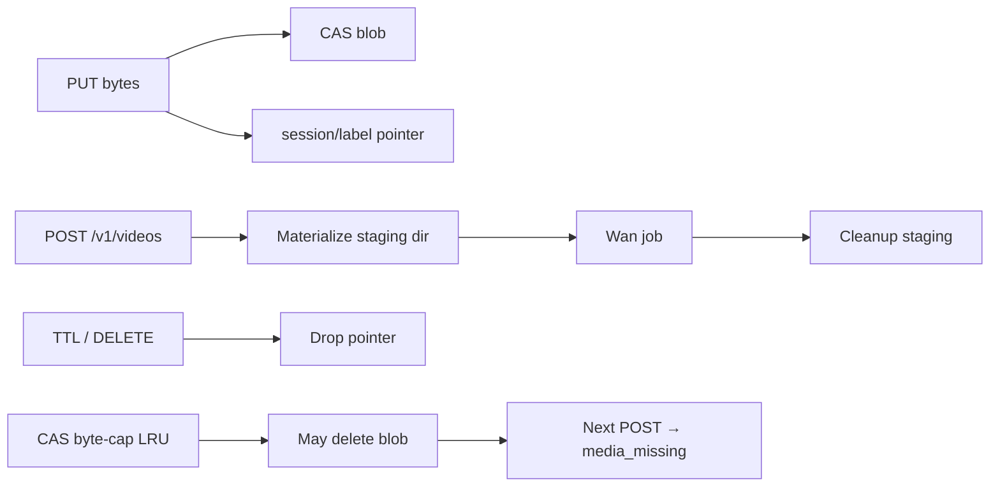

# Media uploads (`/v1/media`)

Session-scoped binary uploads with server-side content-addressed storage (CAS). Agents use this **before** `POST /v1/videos` (and later clip morph) so large frames never ride inside JSON.

**Why this exists:** Animation and video workflows need N stills (keyframes) or clips. Stuffing base64 into `POST /v1/videos` blows middleware body caps, spikes memory on both sides, and makes retries expensive. A separate PUT stream + short JSON refs (`options.media_session` + `options.keyframes`) keeps create requests small and idempotent.

**Why not OpenAI multipart `input_reference` alone:** That shape is fine for one image. Agents generate *sequences* of frames across tools/turns. Session labels let an agent upload `kf0`…`final` as they become ready, `HEAD`/`GET` to verify, then create once. Multipart still is not a separate field on our `/v1/videos` — use this API.

**Why not `$OLLAMA_MODELS/blobs`:** Model layers are permanent, digest-named, and shared across manifests with scheduler pin/refcount. Animation frames are soft state: agent-chosen names, TTL, and “re-PUT on miss.” Mixing them would pollute the model tree and force wrong lifecycle rules.

Package: [`server/media/`](../server/media/). Handlers: [`server/media_handlers.go`](../server/media_handlers.go). Video create: [`server/video_generate.go`](../server/video_generate.go). Wan runner: [`scripts/video/wan_video_generate.py`](../scripts/video/wan_video_generate.py). Operator walkthrough for Wan: [wan-t2v.md](./wan-t2v.md).

---

## Problem → design

| Constraint | Design choice | Why |
|------------|---------------|-----|
| Huge frames must not live in JSON | `PUT /v1/media/{session}/{label}` raw body; create passes labels only | Avoids 8 MiB create-body cap and base64 bloat |
| Same PNG uploaded twice (retries / shared frames) | SHA-256 CAS under `$OLLAMA_MODELS/media/cas/` | Dedup disk; session pointer is a tiny JSON meta file |
| Client must not invent digests | Server hashes on PUT; response returns `digest` | Clients cannot lie about content; miss recovery is re-upload, not “fix digest” |
| Soft state, not model layers | Separate tree under `…/media/` with TTL + CAS byte-cap LRU | Frames are disposable; models are not |
| No refcounting | Delete/TTL drops **pointers**; CAS may linger until LRU | Refcounts need pin/unpin from every job path; agents can simply re-PUT on `media_missing` |
| Multi-backend later (Wan, RIFE, morph) | Store `kind` (`image` / `video` / `other`); validate at create | Same upload API; runners reject wrong kinds with `media_type_mismatch` |
| Create must not race CAS eviction mid-job | Materialize (hardlink/copy) into `$OLLAMA_MODELS/generated/keyframes/kf-*` at submit | Job holds stable paths even if CAS LRU deletes the original blob |
| Staging must not fill disk | Cleanup on submit failure; wrapper `VIDEO_CLEANUP_KEYFRAME_DIR=1` removes staging after run | Failed QoS / train submit must not orphan dirs |
| Labels must be path-safe | `[A-Za-z0-9._-]{1,128}` for session and label | Prevents traversal / weird filesystem names from agent UUIDs |

---

## API

| Method | Path | Notes |
|--------|------|--------|
| `PUT` | `/v1/media/{session}/{label}` | Stream bytes; `201` + `{session,label,digest,bytes,kind}` |
| `HEAD` | `/v1/media/{session}/{label}` | Existence; headers `X-Media-Digest`, `X-Media-Kind`, `Content-Length` |
| `GET` | `/v1/media/{session}/{label}` | Download CAS bytes |
| `GET` | `/v1/media/{session}` | List `{session, labels:[{label,digest,bytes,content_type,kind}]}` |
| `DELETE` | `/v1/media/{session}/{label}` | Drop pointer only (CAS may linger) |

**Limits**

| Kind | Cap | Why |
|------|-----|-----|
| Image PUT | 25 MiB | Keyframes / stills; keeps abuse and RAM bounded |
| Video PUT | 256 MiB | Future clip morph inputs; larger than images by design |
| Other / unknown | 25 MiB | Fail closed to the tighter budget |
| `POST /v1/videos` JSON | 8 MiB | Force large payloads onto `/v1/media` (middleware `MaxBytesReader`) |

**On-disk layout**

```text
$OLLAMA_MODELS/media/
  cas/sha256-<hex>           # content bytes (deduped)
  sessions/<session>/<label>.json   # pointer: digest, size, content_type, kind, timestamps
```

---

## Agent workflow (keyframes → Wan TI2V)

1. Choose a session id (e.g. `anim-$(uuidgen)`).
2. `PUT` each still with a stable label (`kf0`, `kf1`, …, `final`).
3. Optional: `GET /v1/media/{session}` or `HEAD` before create.
4. `POST /v1/videos` with `model=wan2.2-ti2v-5b` and:

```json
{
  "options": {
    "media_session": "<session>",
    "keyframes": ["kf0", "kf1", "final"],
    "frames": 49
  }
}
```

Alternate refs without `media_session`: `"keyframes": ["<session>/kf0", …]`.

5. On **400** `error.code=media_missing` + `missing_labels`: re-PUT those labels and retry create (do not invent digests).
6. Poll `GET /v1/videos/{id}` then download `/content`.

See [wan-t2v.md § Keyframe → inbetweens](./wan-t2v.md#keyframe--inbetweens-ti2v) for semantics (N−1 start-conditioned segments + final still).

---

## Error codes (video create)

| `error.code` | When | Agent action |
|--------------|------|--------------|
| `media_missing` | Label gone, TTL expired, or CAS evicted | Re-PUT listed labels; retry POST |
| `media_type_mismatch` | Wan keyframe is not `kind=image` | Upload images for Wan; video kinds reserved for future morph |
| (plain 400) | T2V profile + keyframes, bad refs, etc. | Fix model/profile or options |

**Why structured codes:** Agents can branch on `media_missing` without scraping English messages. Digests are **not** required on retry — only labels.

---

## Lifecycle (no refcounts)



| Policy | Default | Why |
|--------|---------|-----|
| Pointer TTL | 24 h since create **and** access | Soft state; touch on resolve extends usefulness without immortal files |
| CAS max | ~10 GiB under `media/cas/` | Bound disk; oldest mtime wins eviction |
| Delete | Pointer only | Cheap; avoids refcount races with in-flight jobs that already materialized |
| Miss | `media_missing` | Honest failure; re-upload is the recovery path |

---

## Pluggable runners (same media API)

| Backend | Status | Uses media how |
|---------|--------|----------------|
| `wan` | Shipped | Images → TI2V multi-keyframe / single start frame |
| `rife` | Reserved | Classical optical-flow inbetweens on the same labels |
| Video morph | Roadmap | `kind=video` clips via same PUT surface |

**Why one upload API for all runners:** Agents should not learn a new storage protocol per backend. Manifest `modality_backends.video_generation` selects the runner; media store stays shared.

---

## Code map

| Area | Path |
|------|------|
| CAS + session pointers | `server/media/store.go` |
| HTTP | `server/media_handlers.go` (lazy `getMediaStore`) |
| Routes | `server/routes.go` |
| Create + materialize | `server/video_generate.go` |
| Body cap on create | `middleware/openai.go` |
| Error shapes | `openai/openai.go` (`NewMediaMissingError`, `NewMediaTypeMismatchError`) |
| OpenAPI | `server/openapi/openapi.yaml` |
| Skill | `skills/generate-video/SKILL.md` |

---

## Troubleshooting

| Symptom | Likely cause |
|---------|----------------|
| **413** on PUT | Over image/video cap |
| **413** on POST `/v1/videos` | JSON too large — use `/v1/media` for frames |
| **400** `media_missing` | TTL, LRU, or never uploaded — re-PUT |
| **400** `media_type_mismatch` | Uploaded video/other as Wan keyframe |
| **400** keyframes + `wan2.1-t2v` | Need TI2V profile (`wan2.2-ti2v-5b`) |
| Staging dirs left under `generated/keyframes/` | Submit failed before wrapper ran, or cleanup flag unset — safe to delete `kf-*` dirs when no job is running |

**Why lazy media store init:** `$OLLAMA_MODELS` can be set after package init in tests and some wrappers; constructing the store on first request reads the live env.
