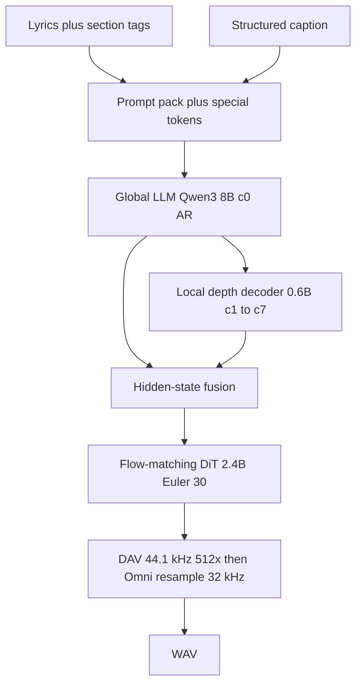

# music-c — MiniMax Music 3 (hear first, C later)

Zerollama does **not** speak MiniMax’s cloud `/v1/music_generation` API. Local songs on this Mac start with **mlx-audio**, not ComfyUI and not a from-scratch 8B C rewrite.

Operator how-to is this file. What we tried and why some forks are dead: [music-c-findings.md](./music-c-findings.md). ROADMAP: [ROADMAP.md § Music generation](./ROADMAP.md#music-generation--minimax-music-3).

## Why this exists

| Temptation | Why we did not |
|------------|----------------|
| MiniMax **cloud** music + cover | Different product; needs their API key; not local weights. |
| **ComfyUI** `comfy.ldm.minimax_music` as runtime | **GPL-3.0.** Readable architecture notes on disk only — never `pip install`, never copy into this tree. Lyrics normalize is **not** Omni-identical (Comfy regex-splits tags; Omni drops same-line text after `[Verse]`). |
| Wait for **SGLang-Omni CUDA** `sgl-omni serve` | Omni `acoustic.py` needs CUDA. This Mac would never hear a clip. Omni remains **rematch gold** (Apache-2.0), not the first listen. |
| **57 GB fp32** HF pack first | Disk and RAM; mlx-community 8-bit (~14 GB) is enough to hear. |
| Reuse **H3 AudioVAE** (`x/video-c`) | H3 is hop **800**, 32 ch, BigVGAN SnakeBeta, joint video+audio. Music DAV is DAC-style hop **512**, 44.1 kHz stereo folded 2×64. Copy Snake/conv **kernels**, not the module. |
| Stock **Qwen3 GGUF** for AR | Vocab 200k + music specials + `embed_tokens_audio`. Wrong tokenizer = garbage codes. |
| Block **`POST /v1/audio/speech`** for a 3-minute song | Same reason Wan is async: minutes of Metal/CUDA. TTS clients expect bytes; Music 3 returns **202 JSON**. |
| Bind **11434 / 8081** to “verify” | Production inference. Lab CLI writes `/tmp`; HTTP is optional after serve restart. |

**Why mlx-audio first:** native MLX on Apple Silicon, MiniMax Music 3 in Blaizzy `#888`, no Comfy, no CUDA Omni. Pin until PyPI ships Music 3: `784b29e2691a93ca7483147d86f61859dfaa6296`.

**Why C at all:** long-term host rematch (prompt/chunk/DAV, later DiT) without a GPL runtime and without waiting on CUDA. Parked until a WAV existed so we did not debug silent kernels.

## Hear a clip (Phase 0)

```bash
uv venv --python 3.11 .venv-music
uv pip install --python .venv-music \
  "mlx-audio @ git+https://github.com/Blaizzy/mlx-audio.git@784b29e2691a93ca7483147d86f61859dfaa6296" \
  huggingface_hub
hf download mlx-community/MiniMax-Music3-8bit --local-dir ~/.zerollama/models/MiniMax-Music3-8bit
.venv-music/bin/python scripts/audio/music3_mlx_generate.py \
  --model ~/.zerollama/models/MiniMax-Music3-8bit \
  --duration 10 --seed 7 --out /tmp/music3_10s.wav
```

| Quant | Disk | Why pick it |
|-------|------|-------------|
| `MiniMax-Music3-8bit` | ~14 GB | Default first listen (Mac lab Aug 2026: ~10 s wall ~4 min) |
| MXFP4 | ~8 GB | Tighter disk; weaker lyric adherence |
| MXFP8 | between | If 8-bit lyrics are mushy |

Structure tags (`[Verse]`, `[Chorus]`) must sit on **their own lines**. Same-line `[Verse] Walking…` is Omni-stripped (lyrics dropped). Instrumental: `[Intro]\n(instrumental)` (Omni) or `[instrumental]` (mlx-audio card).

mlx-audio writes **44.1 kHz** WAV. Omni’s CUDA path resamples DAV → **32 kHz**. Do not treat sample rate as rematch gold.

Do not bind production ports **11434 / 8081**. Do not bounce `uma_daemon`.

## Rematch gold (C)

Clone [sgl-project/sglang-omni](https://github.com/sgl-project/sglang-omni) as `../sglang-omni` when dumping live Python. Sibling `../sglang` has **zero** Music 3 files.

Omni pack layout (`checkpoint.py`) — **not** the diffusers split:

```
~/.zerollama/models/MiniMax-Music3/
  qwen_7B/qwen_7B/          # name says 7B; config is Qwen3-8B
  qwen_7B/qwen3-8B-tokenizer-music/
  flowmatching_vae.pth      # ~9.83 GiB DiT
  dav.pth                   # ~492 MiB DAC decoder only
```

```bash
python3 x/music-c/tools/dump_music3_contract.py
make -C x/music-c test
./x/music-c/music-cli --info --ckpt-dir ~/.zerollama/models/MiniMax-Music3-8bit
./x/music-c/music-cli --tokenize --lyrics $'[Verse]\nHi'   # packed prompt string, not BPE
./x/music-c/music-cli --decode-audio --latent-t 2 --out /tmp/music3_synth.wav
```

`--decode-audio` is **synthetic** zeros × 512 at 44.1 kHz until `dav.pth` exists:

```bash
python3 x/music-c/tools/export_dav_safetensors.py --ckpt-dir ~/.zerollama/models/MiniMax-Music3
```

**Why `--tokenize` is a prompt dump:** BMTL Qwen3 + music specials is a later brick. Shipping a fake GGUF tokenize would hide the missing vocab. Fail-fast specials (must match tokenizer): `im_start` 151644, `audio_cfg` 151654, `audio_start` 151669, `audio_end` 151670, caption 151671–72, lyrics 151673–74, `AUDIO_CODE_OFFSET` 151675.

Prompt string: `<|im_start|><|caption_start|>{clean_caption}<|caption_end|><|lyrics_start|>{normalize_lyrics}<|lyrics_end|><|im_end|><|audio_start|>`.

## HTTP (lab)

**Why training `run_script`:** Music is a multi-minute Metal/CUDA child, same class as Wan. Embed CPython has no mlx-audio; Go must point `python_bin` at `.venv-music` (or `ZEROLLAMA_MUSIC_PYTHON`). **Why exclusive GPU hold:** UMA chat reloading llama-server mid-DiT OOMs / stalls — same `acquireVideoExclusiveGPU` as `/v1/videos`.

**Why `{job_id}` in every env string:** Go does not know the Python uuid at submit. Historically only `WAN_OUTPUT_PATH` was expanded; Music wrote a literal `{job_id}.wav` and `/content` 502’d. `training.py` `_expand_run_script_job_id` now rewrites **all** string env values.

Register `minimax-music3:lab` (restart serve first so Go routes exist):

```bash
./scripts/audio/register_music3_models.sh
```

| Route | Why |
|-------|-----|
| `POST /v1/audio/generations` | Async job JSON (202). Prefer this for new clients. |
| `GET /v1/audio/generations/:id` | Poll until `completed`. |
| `GET /v1/audio/generations/:id/content` | WAV bytes from `$OLLAMA_MODELS/generated/<id>.wav`. |
| `POST /v1/audio/speech` + `speech=music3` | Same queue. **Not** OpenAI sync WAV. Piper/remote-tts still return 200 bytes. |

JSON: lyrics = `input`, caption = `instructions`. Explicit **`duration` wins** over `max_new_tokens` (AR frames / 25 fps) so a client cannot silently shrink a 30 s request with leftover Omni fields.

Not MiniMax cloud `/v1/music_generation`. Cover / lyrics-gen APIs stay out of scope.

## Architecture (port later)



Do **not** add `--family music` to video-c. Do **not** bounce `uma_daemon`.

## Out of scope

Cloud cover / lyrics-generation. Vendoring Comfy. Stock Qwen3 GGUF. C `--generate` (AR 8B + DiT 2.4B) until DAV rematch exists.
